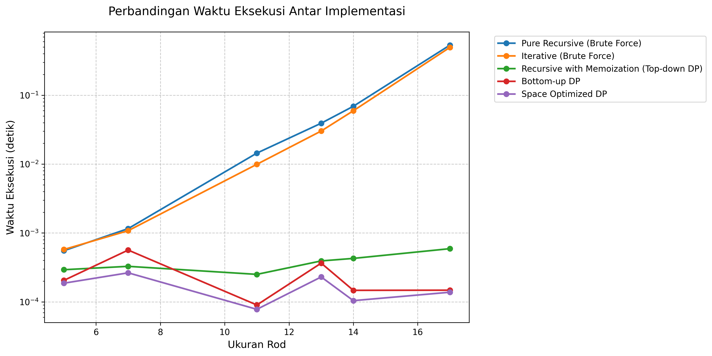
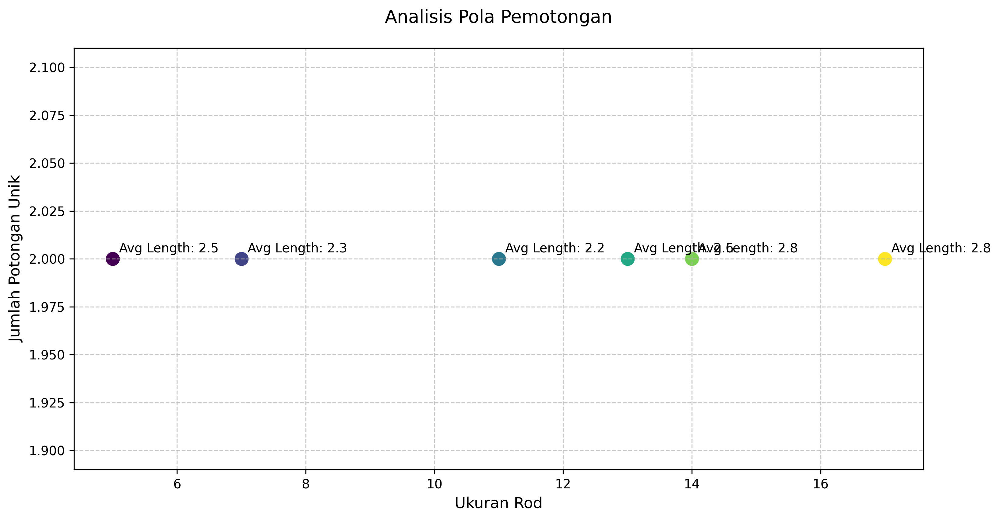
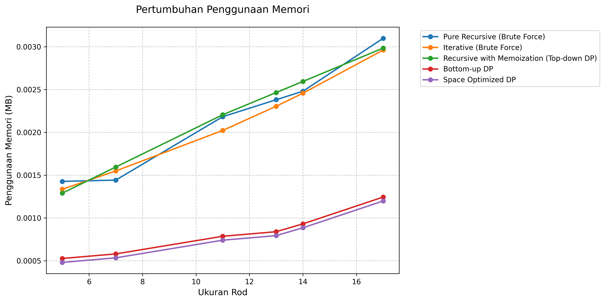
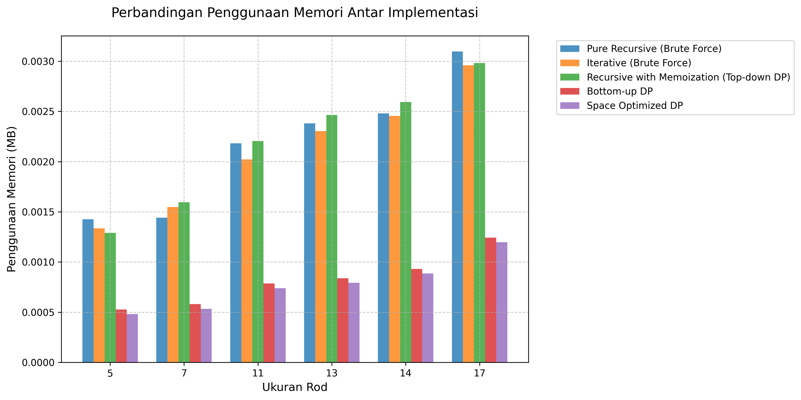

# Analisis Rod Cutting Problem

## Kategorisasi Implementasi

### 1. Implementasi Tanpa Dynamic Programming (Brute Force)

#### Pure Recursive
- Menggunakan rekursi murni tanpa optimasi
- Menghitung ulang subproblem yang sama berkali-kali
- Kompleksitas Waktu: O(2^n)
- Kompleksitas Ruang: O(n) untuk call stack

#### Iterative (Brute Force)
- Mencoba semua kombinasi pemotongan yang mungkin
- Tidak menggunakan memoization atau tabulasi
- Kompleksitas Waktu: O(n * 2^n)
- Kompleksitas Ruang: O(2^n) untuk menyimpan kombinasi

### 2. Implementasi dengan Dynamic Programming

#### Recursive dengan Memoization (Top-down DP)
- Menggunakan DP dengan pendekatan top-down
- Menyimpan hasil perhitungan dalam dictionary
- Kompleksitas Waktu: O(n²)
- Trade-off antara waktu dan memori

#### Bottom-up DP
- Menggunakan DP dengan pendekatan bottom-up
- Membangun solusi dari subproblem terkecil
- Kompleksitas Waktu: O(n²)
- Lebih efisien dalam penggunaan memori dibanding top-down

### 3. Implementasi dengan Optimasi

#### Space Optimized DP
- Berbasis Bottom-up DP
- Mengoptimalkan penggunaan memori
- Kompleksitas Waktu: O(n²)
- Overhead memori minimal

## Hasil Pengujian Detail

### Ukuran Input: 5

**Daftar Harga:**
```
[14, 30, 58, 61, 79]
```

**Analisis Harga per Unit:**
```
  Panjang 1: 14.00 per unit
  Panjang 2: 15.00 per unit
  Panjang 3: 19.33 per unit ⭐ (optimal per unit)
  Panjang 4: 15.25 per unit
  Panjang 5: 15.80 per unit
```

### Ukuran Input: 7

**Daftar Harga:**
```
[15, 30, 55, 58, 76, 79, 100]
```

**Analisis Harga per Unit:**
```
  Panjang 1: 15.00 per unit
  Panjang 2: 15.00 per unit
  Panjang 3: 18.33 per unit ⭐ (optimal per unit)
  Panjang 4: 14.50 per unit
  Panjang 5: 15.20 per unit
  Panjang 6: 13.17 per unit
  Panjang 7: 14.29 per unit
```

### Ukuran Input: 11

**Daftar Harga:**
```
[15, 28, 57, 60, 80, 83, 94, 97, 100, 103, 106]
```

**Analisis Harga per Unit:**
```
  Panjang 1: 15.00 per unit
  Panjang 2: 14.00 per unit
  Panjang 3: 19.00 per unit ⭐ (optimal per unit)
  Panjang 4: 15.00 per unit
  Panjang 5: 16.00 per unit
  Panjang 6: 13.83 per unit
  Panjang 7: 13.43 per unit
  Panjang 8: 12.12 per unit
  Panjang 9: 11.11 per unit
  Panjang 10: 10.30 per unit
  Panjang 11: 9.64 per unit
```

### Ukuran Input: 13

**Daftar Harga:**
```
[14, 31, 59, 62, 78, 81, 96, 99, 102, 105, 108, 111, 119]
```

**Analisis Harga per Unit:**
```
  Panjang 1: 14.00 per unit
  Panjang 2: 15.50 per unit
  Panjang 3: 19.67 per unit ⭐ (optimal per unit)
  Panjang 4: 15.50 per unit
  Panjang 5: 15.60 per unit
  Panjang 6: 13.50 per unit
  Panjang 7: 13.71 per unit
  Panjang 8: 12.38 per unit
  Panjang 9: 11.33 per unit
  Panjang 10: 10.50 per unit
  Panjang 11: 9.82 per unit
  Panjang 12: 9.25 per unit
  Panjang 13: 9.15 per unit
```

### Ukuran Input: 14

**Daftar Harga:**
```
[14, 32, 56, 59, 77, 80, 94, 97, 100, 103, 106, 109, 121, 124]
```

**Analisis Harga per Unit:**
```
  Panjang 1: 14.00 per unit
  Panjang 2: 16.00 per unit
  Panjang 3: 18.67 per unit ⭐ (optimal per unit)
  Panjang 4: 14.75 per unit
  Panjang 5: 15.40 per unit
  Panjang 6: 13.33 per unit
  Panjang 7: 13.43 per unit
  Panjang 8: 12.12 per unit
  Panjang 9: 11.11 per unit
  Panjang 10: 10.30 per unit
  Panjang 11: 9.64 per unit
  Panjang 12: 9.08 per unit
  Panjang 13: 9.31 per unit
  Panjang 14: 8.86 per unit
```

### Ukuran Input: 17

**Daftar Harga:**
```
[15, 31, 53, 56, 83, 86, 96, 99, 102, 105, 108, 111, 120, 123, 126, 133, 149]
```

**Analisis Harga per Unit:**
```
  Panjang 1: 15.00 per unit
  Panjang 2: 15.50 per unit
  Panjang 3: 17.67 per unit ⭐ (optimal per unit)
  Panjang 4: 14.00 per unit
  Panjang 5: 16.60 per unit
  Panjang 6: 14.33 per unit
  Panjang 7: 13.71 per unit
  Panjang 8: 12.38 per unit
  Panjang 9: 11.33 per unit
  Panjang 10: 10.50 per unit
  Panjang 11: 9.82 per unit
  Panjang 12: 9.25 per unit
  Panjang 13: 9.23 per unit
  Panjang 14: 8.79 per unit
  Panjang 15: 8.40 per unit
  Panjang 16: 8.31 per unit
  Panjang 17: 8.76 per unit
```

## Perbandingan Kinerja
### Waktu Eksekusi
| Size | Pure Recursive (Brute Force) | Iterative (Brute Force) | Recursive with Memoization (Top-down DP) | Bottom-up DP | Space Optimized DP |
|---|---|---|---|---|---|
| 5 | 0.000553s | 0.000576s | 0.000293s | 0.000205s | 0.000187s |
| 7 | 0.001158s | 0.001080s | 0.000328s | 0.000565s | 0.000264s |
| 11 | 0.014439s | 0.009935s | 0.000251s | 0.000090s | 0.000078s |
| 13 | 0.039215s | 0.030222s | 0.000393s | 0.000365s | 0.000230s |
| 14 | 0.069131s | 0.059502s | 0.000428s | 0.000147s | 0.000104s |
| 17 | 0.532925s | 0.494231s | 0.000592s | 0.000148s | 0.000138s |

### Analisis Peningkatan Waktu

#### Peningkatan dari ukuran 5 ke 7:
- Pure Recursive (Brute Force): 109.49% 
- Iterative (Brute Force): 87.46% 
- Recursive with Memoization (Top-down DP): 11.96% 
- Bottom-up DP: 175.58% 
- Space Optimized DP: 41.51% 

#### Peningkatan dari ukuran 7 ke 11:
- Pure Recursive (Brute Force): 1146.62% 
- Iterative (Brute Force): 820.07% 
- Recursive with Memoization (Top-down DP): -23.55% 
- Bottom-up DP: -84.05% 
- Space Optimized DP: -70.49% 

#### Peningkatan dari ukuran 11 ke 13:
- Pure Recursive (Brute Force): 171.59% 
- Iterative (Brute Force): 204.20% 
- Recursive with Memoization (Top-down DP): 56.75% 
- Bottom-up DP: 305.03% 
- Space Optimized DP: 195.11% 

#### Peningkatan dari ukuran 13 ke 14:
- Pure Recursive (Brute Force): 76.29% 
- Iterative (Brute Force): 96.88% 
- Recursive with Memoization (Top-down DP): 8.79% 
- Bottom-up DP: -59.70% 
- Space Optimized DP: -54.72% 

#### Peningkatan dari ukuran 14 ke 17:
- Pure Recursive (Brute Force): 670.89% 
- Iterative (Brute Force): 730.61% 
- Recursive with Memoization (Top-down DP): 38.41% 
- Bottom-up DP: 0.49% 
- Space Optimized DP: 32.49% 

### Penggunaan Memori
| Size | Pure Recursive (Brute Force) | Iterative (Brute Force) | Recursive with Memoization (Top-down DP) | Bottom-up DP | Space Optimized DP |
|---|---|---|---|---|---|
| 5 | 1.46 KB | 1.37 KB | 1.32 KB | 552.00 bytes | 504.00 bytes |
| 7 | 1.48 KB | 1.59 KB | 1.63 KB | 608.00 bytes | 560.00 bytes |
| 11 | 2.23 KB | 2.07 KB | 2.26 KB | 824.00 bytes | 776.00 bytes |
| 13 | 2.44 KB | 2.36 KB | 2.52 KB | 880.00 bytes | 832.00 bytes |
| 14 | 2.54 KB | 2.52 KB | 2.66 KB | 976.00 bytes | 928.00 bytes |
| 17 | 3.17 KB | 3.03 KB | 3.05 KB | 1.27 KB | 1.23 KB |

## Analisis Hasil
### Nilai Optimal dan Pola Pemotongan
| Size | Pure Recursive (Brute Force) | Iterative (Brute Force) | Recursive with Memoization (Top-down DP) | Bottom-up DP | Space Optimized DP |
|---|---|---|---|---|---|
| 5 | 88 ([2, 3]) | 88 ([2, 3]) | 88 ([2, 3]) | 88 ([3, 2]) | 88 ([3, 2]) |
| 7 | 125 ([1, 3, 3]) | 125 ([1, 3, 3]) | 125 ([1, 3, 3]) | 125 ([3, 3, 1]) | 125 ([3, 3, 1]) |
| 11 | 201 ([1, 1, 3, 3, 3]) | 201 ([1, 1, 3, 3, 3]) | 201 ([1, 1, 3, 3, 3]) | 201 ([3, 3, 3, 1, 1]) | 201 ([3, 3, 3, 1, 1]) |
| 13 | 250 ([1, 3, 3, 3, 3]) | 250 ([1, 3, 3, 3, 3]) | 250 ([1, 3, 3, 3, 3]) | 250 ([3, 3, 3, 3, 1]) | 250 ([3, 3, 3, 3, 1]) |
| 14 | 256 ([2, 3, 3, 3, 3]) | 256 ([2, 3, 3, 3, 3]) | 256 ([2, 3, 3, 3, 3]) | 256 ([3, 3, 3, 3, 2]) | 256 ([3, 3, 3, 3, 2]) |
| 17 | 296 ([2, 3, 3, 3, 3, 3]) | 296 ([2, 3, 3, 3, 3, 3]) | 296 ([2, 3, 3, 3, 3, 3]) | 296 ([3, 3, 3, 3, 3, 2]) | 296 ([3, 3, 3, 3, 3, 2]) |

### Analisis Efisiensi Detail

#### Size 5

**Pure Recursive (Brute Force)**
- Nilai Total: 88
- Pola Potong: [2, 3]
- Harga per Unit: 17.60
- Efisiensi vs No Cut: 11.4%
- Detail perhitungan:
```
  Panjang 2 (x1): 30 (per unit: 15.00)
  Panjang 3 (x1): 58 (per unit: 19.33)
  Total: 88
```

**Iterative (Brute Force)**
- Nilai Total: 88
- Pola Potong: [2, 3]
- Harga per Unit: 17.60
- Efisiensi vs No Cut: 11.4%
- Detail perhitungan:
```
  Panjang 2 (x1): 30 (per unit: 15.00)
  Panjang 3 (x1): 58 (per unit: 19.33)
  Total: 88
```

**Recursive with Memoization (Top-down DP)**
- Nilai Total: 88
- Pola Potong: [2, 3]
- Harga per Unit: 17.60
- Efisiensi vs No Cut: 11.4%
- Detail perhitungan:
```
  Panjang 2 (x1): 30 (per unit: 15.00)
  Panjang 3 (x1): 58 (per unit: 19.33)
  Total: 88
```

**Bottom-up DP**
- Nilai Total: 88
- Pola Potong: [3, 2]
- Harga per Unit: 17.60
- Efisiensi vs No Cut: 11.4%
- Detail perhitungan:
```
  Panjang 2 (x1): 30 (per unit: 15.00)
  Panjang 3 (x1): 58 (per unit: 19.33)
  Total: 88
```

**Space Optimized DP**
- Nilai Total: 88
- Pola Potong: [3, 2]
- Harga per Unit: 17.60
- Efisiensi vs No Cut: 11.4%
- Detail perhitungan:
```
  Panjang 2 (x1): 30 (per unit: 15.00)
  Panjang 3 (x1): 58 (per unit: 19.33)
  Total: 88
```

#### Size 7

**Pure Recursive (Brute Force)**
- Nilai Total: 125
- Pola Potong: [1, 3, 3]
- Harga per Unit: 17.86
- Efisiensi vs No Cut: 25.0%
- Detail perhitungan:
```
  Panjang 1 (x1): 15 (per unit: 15.00)
  Panjang 3 (x2): 55 (per unit: 18.33)
  Total: 125
```

**Iterative (Brute Force)**
- Nilai Total: 125
- Pola Potong: [1, 3, 3]
- Harga per Unit: 17.86
- Efisiensi vs No Cut: 25.0%
- Detail perhitungan:
```
  Panjang 1 (x1): 15 (per unit: 15.00)
  Panjang 3 (x2): 55 (per unit: 18.33)
  Total: 125
```

**Recursive with Memoization (Top-down DP)**
- Nilai Total: 125
- Pola Potong: [1, 3, 3]
- Harga per Unit: 17.86
- Efisiensi vs No Cut: 25.0%
- Detail perhitungan:
```
  Panjang 1 (x1): 15 (per unit: 15.00)
  Panjang 3 (x2): 55 (per unit: 18.33)
  Total: 125
```

**Bottom-up DP**
- Nilai Total: 125
- Pola Potong: [3, 3, 1]
- Harga per Unit: 17.86
- Efisiensi vs No Cut: 25.0%
- Detail perhitungan:
```
  Panjang 1 (x1): 15 (per unit: 15.00)
  Panjang 3 (x2): 55 (per unit: 18.33)
  Total: 125
```

**Space Optimized DP**
- Nilai Total: 125
- Pola Potong: [3, 3, 1]
- Harga per Unit: 17.86
- Efisiensi vs No Cut: 25.0%
- Detail perhitungan:
```
  Panjang 1 (x1): 15 (per unit: 15.00)
  Panjang 3 (x2): 55 (per unit: 18.33)
  Total: 125
```

#### Size 11

**Pure Recursive (Brute Force)**
- Nilai Total: 201
- Pola Potong: [1, 1, 3, 3, 3]
- Harga per Unit: 18.27
- Efisiensi vs No Cut: 89.6%
- Detail perhitungan:
```
  Panjang 1 (x2): 15 (per unit: 15.00)
  Panjang 3 (x3): 57 (per unit: 19.00)
  Total: 201
```

**Iterative (Brute Force)**
- Nilai Total: 201
- Pola Potong: [1, 1, 3, 3, 3]
- Harga per Unit: 18.27
- Efisiensi vs No Cut: 89.6%
- Detail perhitungan:
```
  Panjang 1 (x2): 15 (per unit: 15.00)
  Panjang 3 (x3): 57 (per unit: 19.00)
  Total: 201
```

**Recursive with Memoization (Top-down DP)**
- Nilai Total: 201
- Pola Potong: [1, 1, 3, 3, 3]
- Harga per Unit: 18.27
- Efisiensi vs No Cut: 89.6%
- Detail perhitungan:
```
  Panjang 1 (x2): 15 (per unit: 15.00)
  Panjang 3 (x3): 57 (per unit: 19.00)
  Total: 201
```

**Bottom-up DP**
- Nilai Total: 201
- Pola Potong: [3, 3, 3, 1, 1]
- Harga per Unit: 18.27
- Efisiensi vs No Cut: 89.6%
- Detail perhitungan:
```
  Panjang 1 (x2): 15 (per unit: 15.00)
  Panjang 3 (x3): 57 (per unit: 19.00)
  Total: 201
```

**Space Optimized DP**
- Nilai Total: 201
- Pola Potong: [3, 3, 3, 1, 1]
- Harga per Unit: 18.27
- Efisiensi vs No Cut: 89.6%
- Detail perhitungan:
```
  Panjang 1 (x2): 15 (per unit: 15.00)
  Panjang 3 (x3): 57 (per unit: 19.00)
  Total: 201
```

#### Size 13

**Pure Recursive (Brute Force)**
- Nilai Total: 250
- Pola Potong: [1, 3, 3, 3, 3]
- Harga per Unit: 19.23
- Efisiensi vs No Cut: 110.1%
- Detail perhitungan:
```
  Panjang 1 (x1): 14 (per unit: 14.00)
  Panjang 3 (x4): 59 (per unit: 19.67)
  Total: 250
```

**Iterative (Brute Force)**
- Nilai Total: 250
- Pola Potong: [1, 3, 3, 3, 3]
- Harga per Unit: 19.23
- Efisiensi vs No Cut: 110.1%
- Detail perhitungan:
```
  Panjang 1 (x1): 14 (per unit: 14.00)
  Panjang 3 (x4): 59 (per unit: 19.67)
  Total: 250
```

**Recursive with Memoization (Top-down DP)**
- Nilai Total: 250
- Pola Potong: [1, 3, 3, 3, 3]
- Harga per Unit: 19.23
- Efisiensi vs No Cut: 110.1%
- Detail perhitungan:
```
  Panjang 1 (x1): 14 (per unit: 14.00)
  Panjang 3 (x4): 59 (per unit: 19.67)
  Total: 250
```

**Bottom-up DP**
- Nilai Total: 250
- Pola Potong: [3, 3, 3, 3, 1]
- Harga per Unit: 19.23
- Efisiensi vs No Cut: 110.1%
- Detail perhitungan:
```
  Panjang 1 (x1): 14 (per unit: 14.00)
  Panjang 3 (x4): 59 (per unit: 19.67)
  Total: 250
```

**Space Optimized DP**
- Nilai Total: 250
- Pola Potong: [3, 3, 3, 3, 1]
- Harga per Unit: 19.23
- Efisiensi vs No Cut: 110.1%
- Detail perhitungan:
```
  Panjang 1 (x1): 14 (per unit: 14.00)
  Panjang 3 (x4): 59 (per unit: 19.67)
  Total: 250
```

#### Size 14

**Pure Recursive (Brute Force)**
- Nilai Total: 256
- Pola Potong: [2, 3, 3, 3, 3]
- Harga per Unit: 18.29
- Efisiensi vs No Cut: 106.5%
- Detail perhitungan:
```
  Panjang 2 (x1): 32 (per unit: 16.00)
  Panjang 3 (x4): 56 (per unit: 18.67)
  Total: 256
```

**Iterative (Brute Force)**
- Nilai Total: 256
- Pola Potong: [2, 3, 3, 3, 3]
- Harga per Unit: 18.29
- Efisiensi vs No Cut: 106.5%
- Detail perhitungan:
```
  Panjang 2 (x1): 32 (per unit: 16.00)
  Panjang 3 (x4): 56 (per unit: 18.67)
  Total: 256
```

**Recursive with Memoization (Top-down DP)**
- Nilai Total: 256
- Pola Potong: [2, 3, 3, 3, 3]
- Harga per Unit: 18.29
- Efisiensi vs No Cut: 106.5%
- Detail perhitungan:
```
  Panjang 2 (x1): 32 (per unit: 16.00)
  Panjang 3 (x4): 56 (per unit: 18.67)
  Total: 256
```

**Bottom-up DP**
- Nilai Total: 256
- Pola Potong: [3, 3, 3, 3, 2]
- Harga per Unit: 18.29
- Efisiensi vs No Cut: 106.5%
- Detail perhitungan:
```
  Panjang 2 (x1): 32 (per unit: 16.00)
  Panjang 3 (x4): 56 (per unit: 18.67)
  Total: 256
```

**Space Optimized DP**
- Nilai Total: 256
- Pola Potong: [3, 3, 3, 3, 2]
- Harga per Unit: 18.29
- Efisiensi vs No Cut: 106.5%
- Detail perhitungan:
```
  Panjang 2 (x1): 32 (per unit: 16.00)
  Panjang 3 (x4): 56 (per unit: 18.67)
  Total: 256
```

#### Size 17

**Pure Recursive (Brute Force)**
- Nilai Total: 296
- Pola Potong: [2, 3, 3, 3, 3, 3]
- Harga per Unit: 17.41
- Efisiensi vs No Cut: 98.7%
- Detail perhitungan:
```
  Panjang 2 (x1): 31 (per unit: 15.50)
  Panjang 3 (x5): 53 (per unit: 17.67)
  Total: 296
```

**Iterative (Brute Force)**
- Nilai Total: 296
- Pola Potong: [2, 3, 3, 3, 3, 3]
- Harga per Unit: 17.41
- Efisiensi vs No Cut: 98.7%
- Detail perhitungan:
```
  Panjang 2 (x1): 31 (per unit: 15.50)
  Panjang 3 (x5): 53 (per unit: 17.67)
  Total: 296
```

**Recursive with Memoization (Top-down DP)**
- Nilai Total: 296
- Pola Potong: [2, 3, 3, 3, 3, 3]
- Harga per Unit: 17.41
- Efisiensi vs No Cut: 98.7%
- Detail perhitungan:
```
  Panjang 2 (x1): 31 (per unit: 15.50)
  Panjang 3 (x5): 53 (per unit: 17.67)
  Total: 296
```

**Bottom-up DP**
- Nilai Total: 296
- Pola Potong: [3, 3, 3, 3, 3, 2]
- Harga per Unit: 17.41
- Efisiensi vs No Cut: 98.7%
- Detail perhitungan:
```
  Panjang 2 (x1): 31 (per unit: 15.50)
  Panjang 3 (x5): 53 (per unit: 17.67)
  Total: 296
```

**Space Optimized DP**
- Nilai Total: 296
- Pola Potong: [3, 3, 3, 3, 3, 2]
- Harga per Unit: 17.41
- Efisiensi vs No Cut: 98.7%
- Detail perhitungan:
```
  Panjang 2 (x1): 31 (per unit: 15.50)
  Panjang 3 (x5): 53 (per unit: 17.67)
  Total: 296
```

## Analisis Trade-off

### 1. Trade-off Waktu vs Memori

#### Pure Recursive (Brute Force)
- Rata-rata Waktu: 0.109570s
- Rata-rata Memori: 2.22 KB
- Waktu Maksimum: 0.532925s
- Memori Maksimum: 3.17 KB

#### Iterative (Brute Force)
- Rata-rata Waktu: 0.099258s
- Rata-rata Memori: 2.15 KB
- Waktu Maksimum: 0.494231s
- Memori Maksimum: 3.03 KB

#### Recursive with Memoization (Top-down DP)
- Rata-rata Waktu: 0.000381s
- Rata-rata Memori: 2.24 KB
- Waktu Maksimum: 0.000592s
- Memori Maksimum: 3.05 KB

#### Bottom-up DP
- Rata-rata Waktu: 0.000253s
- Rata-rata Memori: 857.33 bytes
- Waktu Maksimum: 0.000565s
- Memori Maksimum: 1.27 KB

#### Space Optimized DP
- Rata-rata Waktu: 0.000167s
- Rata-rata Memori: 809.33 bytes
- Waktu Maksimum: 0.000264s
- Memori Maksimum: 1.23 KB

### 2. Karakteristik Implementasi

#### Pure Recursive (Brute Force)
- **Kelebihan:**
  - Implementasi sederhana dan mudah dipahami
  - Cocok untuk debugging karena alur eksekusi jelas
- **Kekurangan:**
  - Waktu eksekusi meningkat eksponensial
  - Banyak perhitungan redundan
- **Best Case:** Input kecil (n ≤ 10) untuk pembelajaran

#### Iterative (Brute Force)
- **Kelebihan:**
  - Menghindari overhead rekursi
  - Lebih efisien dalam penggunaan call stack
- **Kekurangan:**
  - Tetap memerlukan waktu eksponensial
  - Penggunaan memori untuk menyimpan kombinasi
- **Best Case:** Input kecil dengan batasan memori longgar

#### Recursive with Memoization (Top-down DP)
- **Kelebihan:**
  - Hanya menghitung subproblem yang diperlukan
  - Mudah diimplementasi dari versi rekursif
- **Kekurangan:**
  - Overhead dari rekursi masih ada
  - Penggunaan memori untuk memoization
- **Best Case:** Input menengah dengan subproblem berulang

#### Bottom-up DP
- **Kelebihan:**
  - Menghindari overhead rekursi
  - Lebih efisien dalam penggunaan memori
- **Kekurangan:**
  - Menghitung semua subproblem
  - Memerlukan array tambahan untuk tracking
- **Best Case:** Input besar dengan memori mencukupi

#### Space Optimized DP
- **Kelebihan:**
  - Penggunaan memori paling efisien
  - Kinerja waktu tetap kompetitif
- **Kekurangan:**
  - Implementasi lebih kompleks
  - Tracking solusi lebih sulit
- **Best Case:** Input besar dengan batasan memori ketat

### 3. Perbedaan Urutan Pemotongan

Beberapa implementasi menghasilkan urutan pemotongan yang berbeda (misalnya [2, 3] vs [3, 2]) karena:

1. **Arah Pencarian:**
   - Top-down: Memecah masalah dari atas ke bawah
   - Bottom-up: Membangun solusi dari bawah ke atas

2. **Prioritas Pemilihan:**
   - Beberapa implementasi mengutamakan potongan kecil dulu
   - Yang lain mengutamakan potongan besar dulu

3. **Urutan Iterasi:**
   - Iterative: Mencoba kombinasi secara sekuensial
   - DP: Mengoptimalkan berdasarkan subproblem

Semua urutan valid selama menghasilkan nilai optimal yang sama.

### 4. Rekomendasi Penggunaan Berdasarkan Karakteristik Input

#### Berdasarkan Ukuran Input
- **Kecil (n ≤ 10):**
  - Gunakan Pure Recursive untuk pembelajaran
  - Atau Iterative untuk performa lebih baik

- **Menengah (10 < n ≤ 20):**
  - Gunakan Top-down DP jika subproblem sedikit
  - Atau Bottom-up DP untuk konsistensi

- **Besar (n > 20):**
  - Gunakan Bottom-up DP untuk kinerja optimal
  - Atau Space Optimized DP jika memori terbatas

#### Berdasarkan Batasan Panjang Potong
- **Sedikit Pilihan:**
  - Top-down DP lebih efisien karena subproblem lebih sedikit

- **Banyak Pilihan:**
  - Bottom-up DP atau Space Optimized DP untuk konsistensi

#### Berdasarkan Kebutuhan Debugging
- **Fase Development:**
  - Gunakan Pure Recursive atau Top-down DP
  - Lebih mudah di-debug dan dipahami

- **Fase Production:**
  - Gunakan Bottom-up DP atau Space Optimized DP
  - Performa dan efisiensi lebih penting


## Visualisasi
### 1. Perbandingan Waktu Eksekusi


Berdasarkan data pengujian dengan ukuran input [5, 7, 11, 13, 14, 17]:
- **Waktu Eksekusi Terbaik:**
  - Space Optimized DP: 0.000078s
  - Bottom-up DP: 0.000090s
  - Recursive with Memoization (Top-down DP): 0.000251s
  - Pure Recursive (Brute Force): 0.000553s
  - Iterative (Brute Force): 0.000576s

- **Waktu Eksekusi Terburuk:**
  - Pure Recursive (Brute Force): 0.532925s
  - Iterative (Brute Force): 0.494231s
  - Recursive with Memoization (Top-down DP): 0.000592s
  - Bottom-up DP: 0.000565s
  - Space Optimized DP: 0.000264s

### 2. Analisis Pola Pemotongan


Hasil pola pemotongan untuk setiap ukuran input:

**Ukuran 5:**
- Pure Recursive (Brute Force): [2, 3] (Nilai: 88)
- Iterative (Brute Force): [2, 3] (Nilai: 88)
- Recursive with Memoization (Top-down DP): [2, 3] (Nilai: 88)
- Bottom-up DP: [3, 2] (Nilai: 88)
- Space Optimized DP: [3, 2] (Nilai: 88)

**Ukuran 7:**
- Pure Recursive (Brute Force): [1, 3, 3] (Nilai: 125)
- Iterative (Brute Force): [1, 3, 3] (Nilai: 125)
- Recursive with Memoization (Top-down DP): [1, 3, 3] (Nilai: 125)
- Bottom-up DP: [3, 3, 1] (Nilai: 125)
- Space Optimized DP: [3, 3, 1] (Nilai: 125)

**Ukuran 11:**
- Pure Recursive (Brute Force): [1, 1, 3, 3, 3] (Nilai: 201)
- Iterative (Brute Force): [1, 1, 3, 3, 3] (Nilai: 201)
- Recursive with Memoization (Top-down DP): [1, 1, 3, 3, 3] (Nilai: 201)
- Bottom-up DP: [3, 3, 3, 1, 1] (Nilai: 201)
- Space Optimized DP: [3, 3, 3, 1, 1] (Nilai: 201)

**Ukuran 13:**
- Pure Recursive (Brute Force): [1, 3, 3, 3, 3] (Nilai: 250)
- Iterative (Brute Force): [1, 3, 3, 3, 3] (Nilai: 250)
- Recursive with Memoization (Top-down DP): [1, 3, 3, 3, 3] (Nilai: 250)
- Bottom-up DP: [3, 3, 3, 3, 1] (Nilai: 250)
- Space Optimized DP: [3, 3, 3, 3, 1] (Nilai: 250)

**Ukuran 14:**
- Pure Recursive (Brute Force): [2, 3, 3, 3, 3] (Nilai: 256)
- Iterative (Brute Force): [2, 3, 3, 3, 3] (Nilai: 256)
- Recursive with Memoization (Top-down DP): [2, 3, 3, 3, 3] (Nilai: 256)
- Bottom-up DP: [3, 3, 3, 3, 2] (Nilai: 256)
- Space Optimized DP: [3, 3, 3, 3, 2] (Nilai: 256)

**Ukuran 17:**
- Pure Recursive (Brute Force): [2, 3, 3, 3, 3, 3] (Nilai: 296)
- Iterative (Brute Force): [2, 3, 3, 3, 3, 3] (Nilai: 296)
- Recursive with Memoization (Top-down DP): [2, 3, 3, 3, 3, 3] (Nilai: 296)
- Bottom-up DP: [3, 3, 3, 3, 3, 2] (Nilai: 296)
- Space Optimized DP: [3, 3, 3, 3, 3, 2] (Nilai: 296)

### 3. Visualisasi Penggunaan Memori
#### a. Grafik Pertumbuhan Memori


Pengukuran penggunaan memori:
- **Memori Minimum:**
  - Space Optimized DP: 504.00 bytes
  - Bottom-up DP: 552.00 bytes
  - Recursive with Memoization (Top-down DP): 1.32 KB
  - Iterative (Brute Force): 1.37 KB
  - Pure Recursive (Brute Force): 1.46 KB

- **Memori Maksimum:**
  - Pure Recursive (Brute Force): 3.17 KB
  - Recursive with Memoization (Top-down DP): 3.05 KB
  - Iterative (Brute Force): 3.03 KB
  - Bottom-up DP: 1.27 KB
  - Space Optimized DP: 1.23 KB

#### b. Perbandingan Penggunaan Memori


Perbandingan relatif penggunaan memori:
- Pure Recursive (Brute Force) menggunakan 2.59x lebih banyak memori dibanding Space Optimized DP
- Iterative (Brute Force) menggunakan 2.47x lebih banyak memori dibanding Space Optimized DP
- Recursive with Memoization (Top-down DP) menggunakan 2.49x lebih banyak memori dibanding Space Optimized DP
- Bottom-up DP menggunakan 1.04x lebih banyak memori dibanding Space Optimized DP

## Kesimpulan

### Performa Implementasi
1. **Performa Terbaik:** Space Optimized DP
2. **Performa Menengah:** Bottom-up DP, Recursive with Memoization (Top-down DP), Iterative (Brute Force)
3. **Performa Terendah:** Pure Recursive (Brute Force)

### Rekomendasi Penggunaan
1. Untuk dataset kecil (n ≤ 10): Semua implementasi dapat digunakan
2. Untuk dataset menengah (10 < n ≤ 20): Gunakan implementasi DP
3. Untuk dataset besar (n > 20): Gunakan Bottom-up DP atau Space Optimized DP
4. Jika memori terbatas: Gunakan Space Optimized DP
5. Untuk tujuan pembelajaran/debugging: Gunakan Top-down DP

