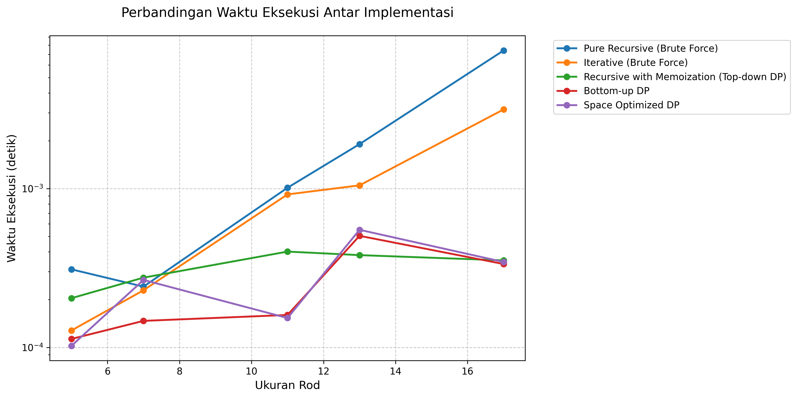
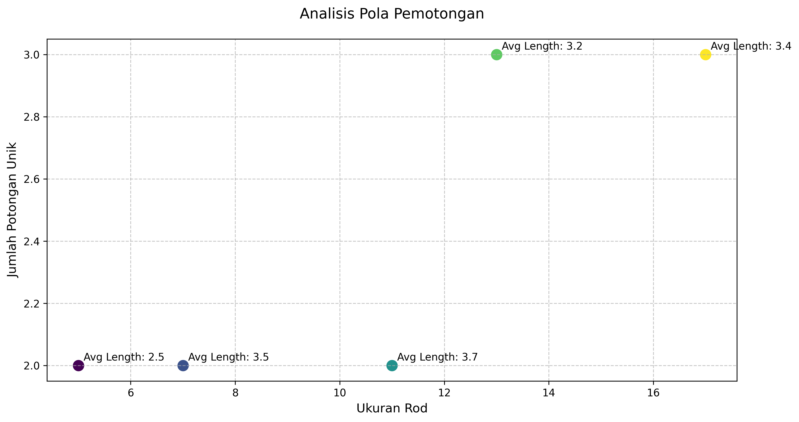
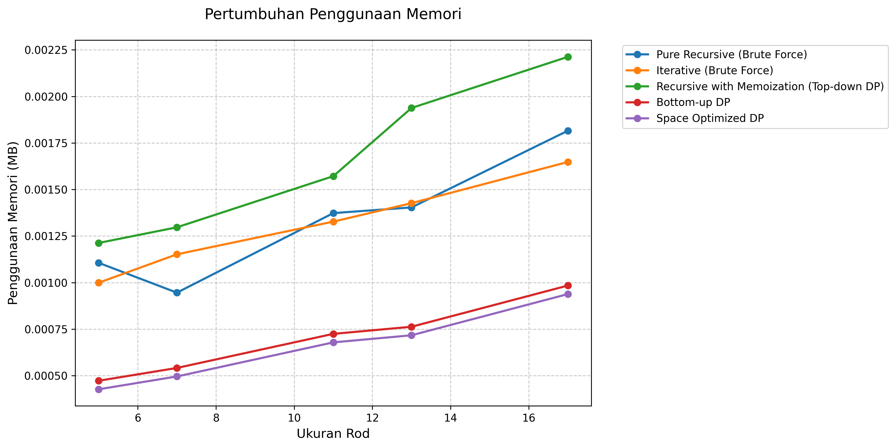
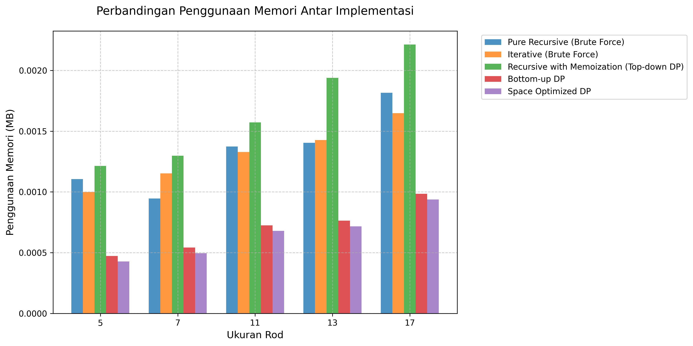

# Analisis Rod Cutting Problem

## Kategorisasi Implementasi

### 1. Implementasi Tanpa Dynamic Programming (Brute Force)

#### Pure Recursive
- Menggunakan rekursi murni tanpa optimasi
- Menghitung ulang subproblem yang sama berkali-kali
- Kompleksitas Waktu: O(2^n)
- Kompleksitas Ruang: O(n) untuk call stack

#### Iterative (Brute Force)
- Mencoba semua kombinasi pemotongan yang mungkin
- Tidak menggunakan memoization atau tabulasi
- Kompleksitas Waktu: O(n * 2^n)
- Kompleksitas Ruang: O(2^n) untuk menyimpan kombinasi

### 2. Implementasi dengan Dynamic Programming

#### Recursive dengan Memoization (Top-down DP)
- Menggunakan DP dengan pendekatan top-down
- Menyimpan hasil perhitungan dalam dictionary
- Kompleksitas Waktu: O(n²)
- Trade-off antara waktu dan memori

#### Bottom-up DP
- Menggunakan DP dengan pendekatan bottom-up
- Membangun solusi dari subproblem terkecil
- Kompleksitas Waktu: O(n²)
- Lebih efisien dalam penggunaan memori dibanding top-down

### 3. Implementasi dengan Optimasi

#### Space Optimized DP
- Berbasis Bottom-up DP
- Mengoptimalkan penggunaan memori
- Kompleksitas Waktu: O(n²)
- Overhead memori minimal

## Batasan Panjang Potong
Panjang yang diperbolehkan: [2, 3, 4]

## Hasil Pengujian Detail

### Ukuran Input: 5

**Daftar Harga:**
```
[0, 12, 20, 30, 0]
```

**Analisis Harga per Unit:**
```
  Panjang 1: 0.00 per unit
  Panjang 2: 6.00 per unit
  Panjang 3: 6.67 per unit
  Panjang 4: 7.50 per unit ⭐ (optimal per unit)
  Panjang 5: 0.00 per unit
```

### Ukuran Input: 7

**Daftar Harga:**
```
[0, 12, 20, 30, 0, 0, 0]
```

**Analisis Harga per Unit:**
```
  Panjang 1: 0.00 per unit
  Panjang 2: 6.00 per unit
  Panjang 3: 6.67 per unit
  Panjang 4: 7.50 per unit ⭐ (optimal per unit)
  Panjang 5: 0.00 per unit
  Panjang 6: 0.00 per unit
  Panjang 7: 0.00 per unit
```

### Ukuran Input: 11

**Daftar Harga:**
```
[0, 12, 20, 30, 0, 0, 0, 0, 0, 0, 0]
```

**Analisis Harga per Unit:**
```
  Panjang 1: 0.00 per unit
  Panjang 2: 6.00 per unit
  Panjang 3: 6.67 per unit
  Panjang 4: 7.50 per unit ⭐ (optimal per unit)
  Panjang 5: 0.00 per unit
  Panjang 6: 0.00 per unit
  Panjang 7: 0.00 per unit
  Panjang 8: 0.00 per unit
  Panjang 9: 0.00 per unit
  Panjang 10: 0.00 per unit
  Panjang 11: 0.00 per unit
```

### Ukuran Input: 13

**Daftar Harga:**
```
[0, 12, 20, 30, 0, 0, 0, 0, 0, 0, 0, 0, 0]
```

**Analisis Harga per Unit:**
```
  Panjang 1: 0.00 per unit
  Panjang 2: 6.00 per unit
  Panjang 3: 6.67 per unit
  Panjang 4: 7.50 per unit ⭐ (optimal per unit)
  Panjang 5: 0.00 per unit
  Panjang 6: 0.00 per unit
  Panjang 7: 0.00 per unit
  Panjang 8: 0.00 per unit
  Panjang 9: 0.00 per unit
  Panjang 10: 0.00 per unit
  Panjang 11: 0.00 per unit
  Panjang 12: 0.00 per unit
  Panjang 13: 0.00 per unit
```

### Ukuran Input: 17

**Daftar Harga:**
```
[0, 12, 20, 30, 0, 0, 0, 0, 0, 0, 0, 0, 0, 0, 0, 0, 0]
```

**Analisis Harga per Unit:**
```
  Panjang 1: 0.00 per unit
  Panjang 2: 6.00 per unit
  Panjang 3: 6.67 per unit
  Panjang 4: 7.50 per unit ⭐ (optimal per unit)
  Panjang 5: 0.00 per unit
  Panjang 6: 0.00 per unit
  Panjang 7: 0.00 per unit
  Panjang 8: 0.00 per unit
  Panjang 9: 0.00 per unit
  Panjang 10: 0.00 per unit
  Panjang 11: 0.00 per unit
  Panjang 12: 0.00 per unit
  Panjang 13: 0.00 per unit
  Panjang 14: 0.00 per unit
  Panjang 15: 0.00 per unit
  Panjang 16: 0.00 per unit
  Panjang 17: 0.00 per unit
```

## Perbandingan Kinerja
### Waktu Eksekusi
| Size | Pure Recursive (Brute Force) | Iterative (Brute Force) | Recursive with Memoization (Top-down DP) | Bottom-up DP | Space Optimized DP |
|---|---|---|---|---|---|
| 5 | 0.000310s | 0.000128s | 0.000204s | 0.000113s | 0.000102s |
| 7 | 0.000241s | 0.000229s | 0.000275s | 0.000147s | 0.000266s |
| 11 | 0.001012s | 0.000919s | 0.000401s | 0.000160s | 0.000153s |
| 13 | 0.001905s | 0.001048s | 0.000381s | 0.000504s | 0.000550s |
| 17 | 0.007406s | 0.003150s | 0.000353s | 0.000335s | 0.000345s |

### Analisis Peningkatan Waktu

#### Peningkatan dari ukuran 5 ke 7:
- Pure Recursive (Brute Force): -22.15% 
- Iterative (Brute Force): 79.10% 
- Recursive with Memoization (Top-down DP): 34.70% 
- Bottom-up DP: 29.96% 
- Space Optimized DP: 159.91% 

#### Peningkatan dari ukuran 7 ke 11:
- Pure Recursive (Brute Force): 319.47% 
- Iterative (Brute Force): 301.56% 
- Recursive with Memoization (Top-down DP): 45.88% 
- Bottom-up DP: 8.93% 
- Space Optimized DP: -42.42% 

#### Peningkatan dari ukuran 11 ke 13:
- Pure Recursive (Brute Force): 88.22% 
- Iterative (Brute Force): 13.98% 
- Recursive with Memoization (Top-down DP): -4.99% 
- Bottom-up DP: 215.05% 
- Space Optimized DP: 259.35% 

#### Peningkatan dari ukuran 13 ke 17:
- Pure Recursive (Brute Force): 288.76% 
- Iterative (Brute Force): 200.68% 
- Recursive with Memoization (Top-down DP): -7.32% 
- Bottom-up DP: -33.54% 
- Space Optimized DP: -37.28% 

### Penggunaan Memori
| Size | Pure Recursive (Brute Force) | Iterative (Brute Force) | Recursive with Memoization (Top-down DP) | Bottom-up DP | Space Optimized DP |
|---|---|---|---|---|---|
| 5 | 1.13 KB | 1.02 KB | 1.24 KB | 496.00 bytes | 448.00 bytes |
| 7 | 992.00 bytes | 1.18 KB | 1.33 KB | 568.00 bytes | 520.00 bytes |
| 11 | 1.41 KB | 1.36 KB | 1.61 KB | 760.00 bytes | 712.00 bytes |
| 13 | 1.44 KB | 1.46 KB | 1.98 KB | 800.00 bytes | 752.00 bytes |
| 17 | 1.86 KB | 1.69 KB | 2.27 KB | 1.01 KB | 984.00 bytes |

## Analisis Hasil
### Nilai Optimal dan Pola Pemotongan
| Size | Pure Recursive (Brute Force) | Iterative (Brute Force) | Recursive with Memoization (Top-down DP) | Bottom-up DP | Space Optimized DP |
|---|---|---|---|---|---|
| 5 | 32 ([2, 3]) | 32 ([2, 3]) | 32 ([2, 3]) | 32 ([3, 2]) | 32 ([3, 2]) |
| 7 | 50 ([3, 4]) | 50 ([3, 4]) | 50 ([3, 4]) | 50 ([4, 3]) | 50 ([4, 3]) |
| 11 | 80 ([3, 4, 4]) | 80 ([3, 4, 4]) | 80 ([3, 4, 4]) | 80 ([4, 4, 3]) | 80 ([4, 4, 3]) |
| 13 | 92 ([2, 3, 4, 4]) | 92 ([2, 3, 4, 4]) | 92 ([2, 3, 4, 4]) | 92 ([4, 4, 3, 2]) | 92 ([4, 4, 3, 2]) |
| 17 | 122 ([2, 3, 4, 4, 4]) | 122 ([2, 3, 4, 4, 4]) | 122 ([2, 3, 4, 4, 4]) | 122 ([4, 4, 4, 3, 2]) | 122 ([4, 4, 4, 3, 2]) |

### Analisis Efisiensi Detail

#### Size 5

**Pure Recursive (Brute Force)**
- Nilai Total: 32
- Pola Potong: [2, 3]
- Harga per Unit: 6.40
- Efisiensi vs No Cut: 3100.0%
- Detail perhitungan:
```
  Panjang 2 (x1): 12 (per unit: 6.00)
  Panjang 3 (x1): 20 (per unit: 6.67)
  Total: 32
```

**Iterative (Brute Force)**
- Nilai Total: 32
- Pola Potong: [2, 3]
- Harga per Unit: 6.40
- Efisiensi vs No Cut: 3100.0%
- Detail perhitungan:
```
  Panjang 2 (x1): 12 (per unit: 6.00)
  Panjang 3 (x1): 20 (per unit: 6.67)
  Total: 32
```

**Recursive with Memoization (Top-down DP)**
- Nilai Total: 32
- Pola Potong: [2, 3]
- Harga per Unit: 6.40
- Efisiensi vs No Cut: 3100.0%
- Detail perhitungan:
```
  Panjang 2 (x1): 12 (per unit: 6.00)
  Panjang 3 (x1): 20 (per unit: 6.67)
  Total: 32
```

**Bottom-up DP**
- Nilai Total: 32
- Pola Potong: [3, 2]
- Harga per Unit: 6.40
- Efisiensi vs No Cut: 3100.0%
- Detail perhitungan:
```
  Panjang 2 (x1): 12 (per unit: 6.00)
  Panjang 3 (x1): 20 (per unit: 6.67)
  Total: 32
```

**Space Optimized DP**
- Nilai Total: 32
- Pola Potong: [3, 2]
- Harga per Unit: 6.40
- Efisiensi vs No Cut: 3100.0%
- Detail perhitungan:
```
  Panjang 2 (x1): 12 (per unit: 6.00)
  Panjang 3 (x1): 20 (per unit: 6.67)
  Total: 32
```

#### Size 7

**Pure Recursive (Brute Force)**
- Nilai Total: 50
- Pola Potong: [3, 4]
- Harga per Unit: 7.14
- Efisiensi vs No Cut: 4900.0%
- Detail perhitungan:
```
  Panjang 3 (x1): 20 (per unit: 6.67)
  Panjang 4 (x1): 30 (per unit: 7.50)
  Total: 50
```

**Iterative (Brute Force)**
- Nilai Total: 50
- Pola Potong: [3, 4]
- Harga per Unit: 7.14
- Efisiensi vs No Cut: 4900.0%
- Detail perhitungan:
```
  Panjang 3 (x1): 20 (per unit: 6.67)
  Panjang 4 (x1): 30 (per unit: 7.50)
  Total: 50
```

**Recursive with Memoization (Top-down DP)**
- Nilai Total: 50
- Pola Potong: [3, 4]
- Harga per Unit: 7.14
- Efisiensi vs No Cut: 4900.0%
- Detail perhitungan:
```
  Panjang 3 (x1): 20 (per unit: 6.67)
  Panjang 4 (x1): 30 (per unit: 7.50)
  Total: 50
```

**Bottom-up DP**
- Nilai Total: 50
- Pola Potong: [4, 3]
- Harga per Unit: 7.14
- Efisiensi vs No Cut: 4900.0%
- Detail perhitungan:
```
  Panjang 3 (x1): 20 (per unit: 6.67)
  Panjang 4 (x1): 30 (per unit: 7.50)
  Total: 50
```

**Space Optimized DP**
- Nilai Total: 50
- Pola Potong: [4, 3]
- Harga per Unit: 7.14
- Efisiensi vs No Cut: 4900.0%
- Detail perhitungan:
```
  Panjang 3 (x1): 20 (per unit: 6.67)
  Panjang 4 (x1): 30 (per unit: 7.50)
  Total: 50
```

#### Size 11

**Pure Recursive (Brute Force)**
- Nilai Total: 80
- Pola Potong: [3, 4, 4]
- Harga per Unit: 7.27
- Efisiensi vs No Cut: 7900.0%
- Detail perhitungan:
```
  Panjang 3 (x1): 20 (per unit: 6.67)
  Panjang 4 (x2): 30 (per unit: 7.50)
  Total: 80
```

**Iterative (Brute Force)**
- Nilai Total: 80
- Pola Potong: [3, 4, 4]
- Harga per Unit: 7.27
- Efisiensi vs No Cut: 7900.0%
- Detail perhitungan:
```
  Panjang 3 (x1): 20 (per unit: 6.67)
  Panjang 4 (x2): 30 (per unit: 7.50)
  Total: 80
```

**Recursive with Memoization (Top-down DP)**
- Nilai Total: 80
- Pola Potong: [3, 4, 4]
- Harga per Unit: 7.27
- Efisiensi vs No Cut: 7900.0%
- Detail perhitungan:
```
  Panjang 3 (x1): 20 (per unit: 6.67)
  Panjang 4 (x2): 30 (per unit: 7.50)
  Total: 80
```

**Bottom-up DP**
- Nilai Total: 80
- Pola Potong: [4, 4, 3]
- Harga per Unit: 7.27
- Efisiensi vs No Cut: 7900.0%
- Detail perhitungan:
```
  Panjang 3 (x1): 20 (per unit: 6.67)
  Panjang 4 (x2): 30 (per unit: 7.50)
  Total: 80
```

**Space Optimized DP**
- Nilai Total: 80
- Pola Potong: [4, 4, 3]
- Harga per Unit: 7.27
- Efisiensi vs No Cut: 7900.0%
- Detail perhitungan:
```
  Panjang 3 (x1): 20 (per unit: 6.67)
  Panjang 4 (x2): 30 (per unit: 7.50)
  Total: 80
```

#### Size 13

**Pure Recursive (Brute Force)**
- Nilai Total: 92
- Pola Potong: [2, 3, 4, 4]
- Harga per Unit: 7.08
- Efisiensi vs No Cut: 9100.0%
- Detail perhitungan:
```
  Panjang 2 (x1): 12 (per unit: 6.00)
  Panjang 3 (x1): 20 (per unit: 6.67)
  Panjang 4 (x2): 30 (per unit: 7.50)
  Total: 92
```

**Iterative (Brute Force)**
- Nilai Total: 92
- Pola Potong: [2, 3, 4, 4]
- Harga per Unit: 7.08
- Efisiensi vs No Cut: 9100.0%
- Detail perhitungan:
```
  Panjang 2 (x1): 12 (per unit: 6.00)
  Panjang 3 (x1): 20 (per unit: 6.67)
  Panjang 4 (x2): 30 (per unit: 7.50)
  Total: 92
```

**Recursive with Memoization (Top-down DP)**
- Nilai Total: 92
- Pola Potong: [2, 3, 4, 4]
- Harga per Unit: 7.08
- Efisiensi vs No Cut: 9100.0%
- Detail perhitungan:
```
  Panjang 2 (x1): 12 (per unit: 6.00)
  Panjang 3 (x1): 20 (per unit: 6.67)
  Panjang 4 (x2): 30 (per unit: 7.50)
  Total: 92
```

**Bottom-up DP**
- Nilai Total: 92
- Pola Potong: [4, 4, 3, 2]
- Harga per Unit: 7.08
- Efisiensi vs No Cut: 9100.0%
- Detail perhitungan:
```
  Panjang 2 (x1): 12 (per unit: 6.00)
  Panjang 3 (x1): 20 (per unit: 6.67)
  Panjang 4 (x2): 30 (per unit: 7.50)
  Total: 92
```

**Space Optimized DP**
- Nilai Total: 92
- Pola Potong: [4, 4, 3, 2]
- Harga per Unit: 7.08
- Efisiensi vs No Cut: 9100.0%
- Detail perhitungan:
```
  Panjang 2 (x1): 12 (per unit: 6.00)
  Panjang 3 (x1): 20 (per unit: 6.67)
  Panjang 4 (x2): 30 (per unit: 7.50)
  Total: 92
```

#### Size 17

**Pure Recursive (Brute Force)**
- Nilai Total: 122
- Pola Potong: [2, 3, 4, 4, 4]
- Harga per Unit: 7.18
- Efisiensi vs No Cut: 12100.0%
- Detail perhitungan:
```
  Panjang 2 (x1): 12 (per unit: 6.00)
  Panjang 3 (x1): 20 (per unit: 6.67)
  Panjang 4 (x3): 30 (per unit: 7.50)
  Total: 122
```

**Iterative (Brute Force)**
- Nilai Total: 122
- Pola Potong: [2, 3, 4, 4, 4]
- Harga per Unit: 7.18
- Efisiensi vs No Cut: 12100.0%
- Detail perhitungan:
```
  Panjang 2 (x1): 12 (per unit: 6.00)
  Panjang 3 (x1): 20 (per unit: 6.67)
  Panjang 4 (x3): 30 (per unit: 7.50)
  Total: 122
```

**Recursive with Memoization (Top-down DP)**
- Nilai Total: 122
- Pola Potong: [2, 3, 4, 4, 4]
- Harga per Unit: 7.18
- Efisiensi vs No Cut: 12100.0%
- Detail perhitungan:
```
  Panjang 2 (x1): 12 (per unit: 6.00)
  Panjang 3 (x1): 20 (per unit: 6.67)
  Panjang 4 (x3): 30 (per unit: 7.50)
  Total: 122
```

**Bottom-up DP**
- Nilai Total: 122
- Pola Potong: [4, 4, 4, 3, 2]
- Harga per Unit: 7.18
- Efisiensi vs No Cut: 12100.0%
- Detail perhitungan:
```
  Panjang 2 (x1): 12 (per unit: 6.00)
  Panjang 3 (x1): 20 (per unit: 6.67)
  Panjang 4 (x3): 30 (per unit: 7.50)
  Total: 122
```

**Space Optimized DP**
- Nilai Total: 122
- Pola Potong: [4, 4, 4, 3, 2]
- Harga per Unit: 7.18
- Efisiensi vs No Cut: 12100.0%
- Detail perhitungan:
```
  Panjang 2 (x1): 12 (per unit: 6.00)
  Panjang 3 (x1): 20 (per unit: 6.67)
  Panjang 4 (x3): 30 (per unit: 7.50)
  Total: 122
```

## Analisis Trade-off

### 1. Trade-off Waktu vs Memori

#### Pure Recursive (Brute Force)
- Rata-rata Waktu: 0.002175s
- Rata-rata Memori: 1.36 KB
- Waktu Maksimum: 0.007406s
- Memori Maksimum: 1.86 KB

#### Iterative (Brute Force)
- Rata-rata Waktu: 0.001095s
- Rata-rata Memori: 1.34 KB
- Waktu Maksimum: 0.003150s
- Memori Maksimum: 1.69 KB

#### Recursive with Memoization (Top-down DP)
- Rata-rata Waktu: 0.000323s
- Rata-rata Memori: 1.69 KB
- Waktu Maksimum: 0.000401s
- Memori Maksimum: 2.27 KB

#### Bottom-up DP
- Rata-rata Waktu: 0.000252s
- Rata-rata Memori: 731.20 bytes
- Waktu Maksimum: 0.000504s
- Memori Maksimum: 1.01 KB

#### Space Optimized DP
- Rata-rata Waktu: 0.000283s
- Rata-rata Memori: 683.20 bytes
- Waktu Maksimum: 0.000550s
- Memori Maksimum: 984.00 bytes

### 2. Karakteristik Implementasi

#### Pure Recursive (Brute Force)
- **Kelebihan:**
  - Implementasi sederhana dan mudah dipahami
  - Cocok untuk debugging karena alur eksekusi jelas
- **Kekurangan:**
  - Waktu eksekusi meningkat eksponensial
  - Banyak perhitungan redundan
- **Best Case:** Input kecil (n ≤ 10) untuk pembelajaran

#### Iterative (Brute Force)
- **Kelebihan:**
  - Menghindari overhead rekursi
  - Lebih efisien dalam penggunaan call stack
- **Kekurangan:**
  - Tetap memerlukan waktu eksponensial
  - Penggunaan memori untuk menyimpan kombinasi
- **Best Case:** Input kecil dengan batasan memori longgar

#### Recursive with Memoization (Top-down DP)
- **Kelebihan:**
  - Hanya menghitung subproblem yang diperlukan
  - Mudah diimplementasi dari versi rekursif
- **Kekurangan:**
  - Overhead dari rekursi masih ada
  - Penggunaan memori untuk memoization
- **Best Case:** Input menengah dengan subproblem berulang

#### Bottom-up DP
- **Kelebihan:**
  - Menghindari overhead rekursi
  - Lebih efisien dalam penggunaan memori
- **Kekurangan:**
  - Menghitung semua subproblem
  - Memerlukan array tambahan untuk tracking
- **Best Case:** Input besar dengan memori mencukupi

#### Space Optimized DP
- **Kelebihan:**
  - Penggunaan memori paling efisien
  - Kinerja waktu tetap kompetitif
- **Kekurangan:**
  - Implementasi lebih kompleks
  - Tracking solusi lebih sulit
- **Best Case:** Input besar dengan batasan memori ketat

### 3. Perbedaan Urutan Pemotongan

Beberapa implementasi menghasilkan urutan pemotongan yang berbeda (misalnya [2, 3] vs [3, 2]) karena:

1. **Arah Pencarian:**
   - Top-down: Memecah masalah dari atas ke bawah
   - Bottom-up: Membangun solusi dari bawah ke atas

2. **Prioritas Pemilihan:**
   - Beberapa implementasi mengutamakan potongan kecil dulu
   - Yang lain mengutamakan potongan besar dulu

3. **Urutan Iterasi:**
   - Iterative: Mencoba kombinasi secara sekuensial
   - DP: Mengoptimalkan berdasarkan subproblem

Semua urutan valid selama menghasilkan nilai optimal yang sama.

### 4. Rekomendasi Penggunaan Berdasarkan Karakteristik Input

#### Berdasarkan Ukuran Input
- **Kecil (n ≤ 10):**
  - Gunakan Pure Recursive untuk pembelajaran
  - Atau Iterative untuk performa lebih baik

- **Menengah (10 < n ≤ 20):**
  - Gunakan Top-down DP jika subproblem sedikit
  - Atau Bottom-up DP untuk konsistensi

- **Besar (n > 20):**
  - Gunakan Bottom-up DP untuk kinerja optimal
  - Atau Space Optimized DP jika memori terbatas

#### Berdasarkan Batasan Panjang Potong
- **Sedikit Pilihan:**
  - Top-down DP lebih efisien karena subproblem lebih sedikit

- **Banyak Pilihan:**
  - Bottom-up DP atau Space Optimized DP untuk konsistensi

#### Berdasarkan Kebutuhan Debugging
- **Fase Development:**
  - Gunakan Pure Recursive atau Top-down DP
  - Lebih mudah di-debug dan dipahami

- **Fase Production:**
  - Gunakan Bottom-up DP atau Space Optimized DP
  - Performa dan efisiensi lebih penting


## Visualisasi
### 1. Perbandingan Waktu Eksekusi


Berdasarkan data pengujian dengan ukuran input [5, 7, 11, 13, 17]:
- **Waktu Eksekusi Terbaik:**
  - Space Optimized DP: 0.000102s
  - Bottom-up DP: 0.000113s
  - Iterative (Brute Force): 0.000128s
  - Recursive with Memoization (Top-down DP): 0.000204s
  - Pure Recursive (Brute Force): 0.000241s

- **Waktu Eksekusi Terburuk:**
  - Pure Recursive (Brute Force): 0.007406s
  - Iterative (Brute Force): 0.003150s
  - Space Optimized DP: 0.000550s
  - Bottom-up DP: 0.000504s
  - Recursive with Memoization (Top-down DP): 0.000401s

### 2. Analisis Pola Pemotongan


Hasil pola pemotongan untuk setiap ukuran input:

**Ukuran 5:**
- Pure Recursive (Brute Force): [2, 3] (Nilai: 32)
- Iterative (Brute Force): [2, 3] (Nilai: 32)
- Recursive with Memoization (Top-down DP): [2, 3] (Nilai: 32)
- Bottom-up DP: [3, 2] (Nilai: 32)
- Space Optimized DP: [3, 2] (Nilai: 32)

**Ukuran 7:**
- Pure Recursive (Brute Force): [3, 4] (Nilai: 50)
- Iterative (Brute Force): [3, 4] (Nilai: 50)
- Recursive with Memoization (Top-down DP): [3, 4] (Nilai: 50)
- Bottom-up DP: [4, 3] (Nilai: 50)
- Space Optimized DP: [4, 3] (Nilai: 50)

**Ukuran 11:**
- Pure Recursive (Brute Force): [3, 4, 4] (Nilai: 80)
- Iterative (Brute Force): [3, 4, 4] (Nilai: 80)
- Recursive with Memoization (Top-down DP): [3, 4, 4] (Nilai: 80)
- Bottom-up DP: [4, 4, 3] (Nilai: 80)
- Space Optimized DP: [4, 4, 3] (Nilai: 80)

**Ukuran 13:**
- Pure Recursive (Brute Force): [2, 3, 4, 4] (Nilai: 92)
- Iterative (Brute Force): [2, 3, 4, 4] (Nilai: 92)
- Recursive with Memoization (Top-down DP): [2, 3, 4, 4] (Nilai: 92)
- Bottom-up DP: [4, 4, 3, 2] (Nilai: 92)
- Space Optimized DP: [4, 4, 3, 2] (Nilai: 92)

**Ukuran 17:**
- Pure Recursive (Brute Force): [2, 3, 4, 4, 4] (Nilai: 122)
- Iterative (Brute Force): [2, 3, 4, 4, 4] (Nilai: 122)
- Recursive with Memoization (Top-down DP): [2, 3, 4, 4, 4] (Nilai: 122)
- Bottom-up DP: [4, 4, 4, 3, 2] (Nilai: 122)
- Space Optimized DP: [4, 4, 4, 3, 2] (Nilai: 122)

### 3. Visualisasi Penggunaan Memori
#### a. Grafik Pertumbuhan Memori


Pengukuran penggunaan memori:
- **Memori Minimum:**
  - Space Optimized DP: 448.00 bytes
  - Bottom-up DP: 496.00 bytes
  - Pure Recursive (Brute Force): 992.00 bytes
  - Iterative (Brute Force): 1.02 KB
  - Recursive with Memoization (Top-down DP): 1.24 KB

- **Memori Maksimum:**
  - Recursive with Memoization (Top-down DP): 2.27 KB
  - Pure Recursive (Brute Force): 1.86 KB
  - Iterative (Brute Force): 1.69 KB
  - Bottom-up DP: 1.01 KB
  - Space Optimized DP: 984.00 bytes

#### b. Perbandingan Penggunaan Memori


Perbandingan relatif penggunaan memori:
- Pure Recursive (Brute Force) menggunakan 1.93x lebih banyak memori dibanding Space Optimized DP
- Iterative (Brute Force) menggunakan 1.76x lebih banyak memori dibanding Space Optimized DP
- Recursive with Memoization (Top-down DP) menggunakan 2.36x lebih banyak memori dibanding Space Optimized DP
- Bottom-up DP menggunakan 1.05x lebih banyak memori dibanding Space Optimized DP

## Kesimpulan

### Performa Implementasi
1. **Performa Terbaik:** Bottom-up DP
2. **Performa Menengah:** Space Optimized DP, Recursive with Memoization (Top-down DP), Iterative (Brute Force)
3. **Performa Terendah:** Pure Recursive (Brute Force)

### Rekomendasi Penggunaan
1. Untuk dataset kecil (n ≤ 10): Semua implementasi dapat digunakan
2. Untuk dataset menengah (10 < n ≤ 20): Gunakan implementasi DP
3. Untuk dataset besar (n > 20): Gunakan Bottom-up DP atau Space Optimized DP
4. Jika memori terbatas: Gunakan Space Optimized DP
5. Untuk tujuan pembelajaran/debugging: Gunakan Top-down DP

