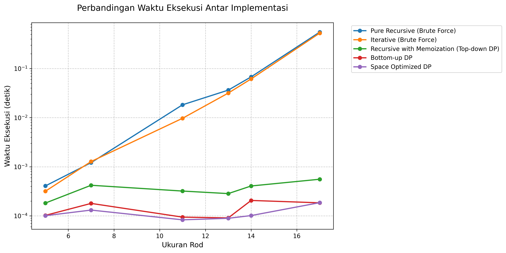
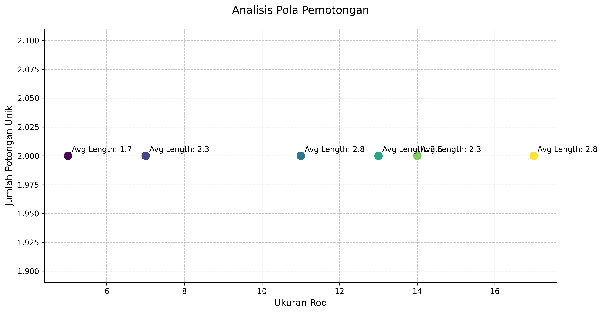
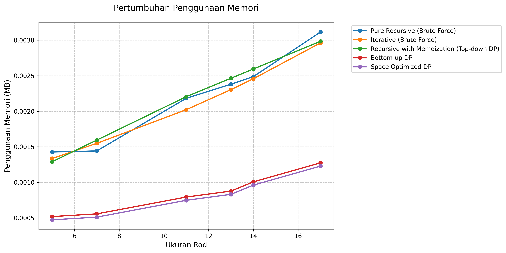
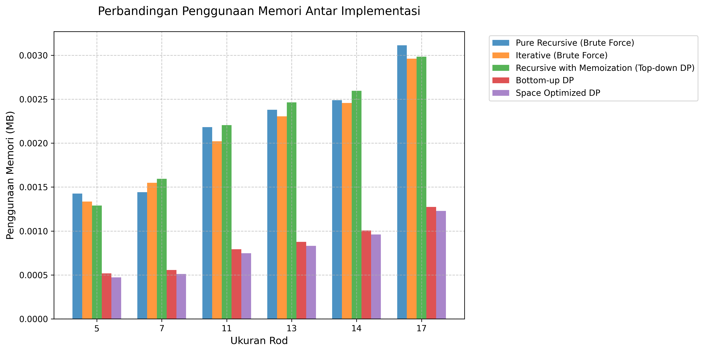

# Analisis Rod Cutting Problem

### Tanggal Pengujian: 2024-12-20 14:56:58

## Kategorisasi Implementasi

### 1. Implementasi Tanpa Dynamic Programming (Brute Force)

#### Pure Recursive
- Menggunakan rekursi murni tanpa optimasi
- Menghitung ulang subproblem yang sama berkali-kali
- Kompleksitas Waktu: O(2^n)
- Kompleksitas Ruang: O(n) untuk call stack

#### Iterative (Brute Force)
- Mencoba semua kombinasi pemotongan yang mungkin
- Tidak menggunakan memoization atau tabulasi
- Kompleksitas Waktu: O(n * 2^n)
- Kompleksitas Ruang: O(2^n) untuk menyimpan kombinasi

### 2. Implementasi dengan Dynamic Programming

#### Recursive dengan Memoization (Top-down DP)
- Menggunakan DP dengan pendekatan top-down
- Menyimpan hasil perhitungan dalam dictionary
- Kompleksitas Waktu: O(n²)
- Trade-off antara waktu dan memori

#### Bottom-up DP
- Menggunakan DP dengan pendekatan bottom-up
- Membangun solusi dari subproblem terkecil
- Kompleksitas Waktu: O(n²)
- Lebih efisien dalam penggunaan memori dibanding top-down

### 3. Implementasi dengan Optimasi

#### Space Optimized DP
- Berbasis Bottom-up DP
- Mengoptimalkan penggunaan memori
- Kompleksitas Waktu: O(n²)
- Overhead memori minimal

## Hasil Pengujian Detail

### Ukuran Input: 5

**Daftar Harga:**
```
[16, 30, 57, 60, 82]
```

**Analisis Harga per Unit:**
```
  Panjang 1: 16.00 per unit
  Panjang 2: 15.00 per unit
  Panjang 3: 19.00 per unit ⭐ (optimal per unit)
  Panjang 4: 15.00 per unit
  Panjang 5: 16.40 per unit
```

### Ukuran Input: 7

**Daftar Harga:**
```
[16, 34, 55, 58, 77, 80, 94]
```

**Analisis Harga per Unit:**
```
  Panjang 1: 16.00 per unit
  Panjang 2: 17.00 per unit
  Panjang 3: 18.33 per unit ⭐ (optimal per unit)
  Panjang 4: 14.50 per unit
  Panjang 5: 15.40 per unit
  Panjang 6: 13.33 per unit
  Panjang 7: 13.43 per unit
```

### Ukuran Input: 11

**Daftar Harga:**
```
[15, 34, 54, 57, 80, 83, 96, 99, 102, 105, 108]
```

**Analisis Harga per Unit:**
```
  Panjang 1: 15.00 per unit
  Panjang 2: 17.00 per unit
  Panjang 3: 18.00 per unit ⭐ (optimal per unit)
  Panjang 4: 14.25 per unit
  Panjang 5: 16.00 per unit
  Panjang 6: 13.83 per unit
  Panjang 7: 13.71 per unit
  Panjang 8: 12.38 per unit
  Panjang 9: 11.33 per unit
  Panjang 10: 10.50 per unit
  Panjang 11: 9.82 per unit
```

### Ukuran Input: 13

**Daftar Harga:**
```
[17, 30, 55, 58, 77, 80, 101, 104, 107, 110, 113, 116, 119]
```

**Analisis Harga per Unit:**
```
  Panjang 1: 17.00 per unit
  Panjang 2: 15.00 per unit
  Panjang 3: 18.33 per unit ⭐ (optimal per unit)
  Panjang 4: 14.50 per unit
  Panjang 5: 15.40 per unit
  Panjang 6: 13.33 per unit
  Panjang 7: 14.43 per unit
  Panjang 8: 13.00 per unit
  Panjang 9: 11.89 per unit
  Panjang 10: 11.00 per unit
  Panjang 11: 10.27 per unit
  Panjang 12: 9.67 per unit
  Panjang 13: 9.15 per unit
```

### Ukuran Input: 14

**Daftar Harga:**
```
[16, 27, 58, 61, 75, 78, 98, 101, 104, 107, 110, 113, 122, 125]
```

**Analisis Harga per Unit:**
```
  Panjang 1: 16.00 per unit
  Panjang 2: 13.50 per unit
  Panjang 3: 19.33 per unit ⭐ (optimal per unit)
  Panjang 4: 15.25 per unit
  Panjang 5: 15.00 per unit
  Panjang 6: 13.00 per unit
  Panjang 7: 14.00 per unit
  Panjang 8: 12.62 per unit
  Panjang 9: 11.56 per unit
  Panjang 10: 10.70 per unit
  Panjang 11: 10.00 per unit
  Panjang 12: 9.42 per unit
  Panjang 13: 9.38 per unit
  Panjang 14: 8.93 per unit
```

### Ukuran Input: 17

**Daftar Harga:**
```
[15, 31, 60, 63, 77, 80, 101, 104, 107, 110, 113, 116, 119, 122, 125, 135, 154]
```

**Analisis Harga per Unit:**
```
  Panjang 1: 15.00 per unit
  Panjang 2: 15.50 per unit
  Panjang 3: 20.00 per unit ⭐ (optimal per unit)
  Panjang 4: 15.75 per unit
  Panjang 5: 15.40 per unit
  Panjang 6: 13.33 per unit
  Panjang 7: 14.43 per unit
  Panjang 8: 13.00 per unit
  Panjang 9: 11.89 per unit
  Panjang 10: 11.00 per unit
  Panjang 11: 10.27 per unit
  Panjang 12: 9.67 per unit
  Panjang 13: 9.15 per unit
  Panjang 14: 8.71 per unit
  Panjang 15: 8.33 per unit
  Panjang 16: 8.44 per unit
  Panjang 17: 9.06 per unit
```

## Perbandingan Kinerja
### Waktu Eksekusi
| Size | Pure Recursive (Brute Force) | Iterative (Brute Force) | Recursive with Memoization (Top-down DP) | Bottom-up DP | Space Optimized DP |
|---|---|---|---|---|---|
| 5 | 0.000407s | 0.000317s | 0.000182s | 0.000102s | 0.000101s |
| 7 | 0.001212s | 0.001278s | 0.000420s | 0.000179s | 0.000131s |
| 11 | 0.018295s | 0.009714s | 0.000320s | 0.000094s | 0.000083s |
| 13 | 0.036403s | 0.031695s | 0.000284s | 0.000091s | 0.000089s |
| 14 | 0.067782s | 0.061505s | 0.000406s | 0.000206s | 0.000101s |
| 17 | 0.553490s | 0.527779s | 0.000557s | 0.000184s | 0.000186s |

### Analisis Peningkatan Waktu

#### Peningkatan dari ukuran 5 ke 7:
- Pure Recursive (Brute Force): 197.77% 
- Iterative (Brute Force): 303.08% 
- Recursive with Memoization (Top-down DP): 130.50% 
- Bottom-up DP: 75.29% 
- Space Optimized DP: 30.02% 

#### Peningkatan dari ukuran 7 ke 11:
- Pure Recursive (Brute Force): 1409.64% 
- Iterative (Brute Force): 659.99% 
- Recursive with Memoization (Top-down DP): -23.79% 
- Bottom-up DP: -47.47% 
- Space Optimized DP: -36.73% 

#### Peningkatan dari ukuran 11 ke 13:
- Pure Recursive (Brute Force): 98.98% 
- Iterative (Brute Force): 226.29% 
- Recursive with Memoization (Top-down DP): -11.25% 
- Bottom-up DP: -3.54% 
- Space Optimized DP: 7.47% 

#### Peningkatan dari ukuran 13 ke 14:
- Pure Recursive (Brute Force): 86.20% 
- Iterative (Brute Force): 94.05% 
- Recursive with Memoization (Top-down DP): 42.99% 
- Bottom-up DP: 126.77% 
- Space Optimized DP: 13.64% 

#### Peningkatan dari ukuran 14 ke 17:
- Pure Recursive (Brute Force): 716.57% 
- Iterative (Brute Force): 758.11% 
- Recursive with Memoization (Top-down DP): 37.17% 
- Bottom-up DP: -10.53% 
- Space Optimized DP: 83.29% 

### Penggunaan Memori
| Size | Pure Recursive (Brute Force) | Iterative (Brute Force) | Recursive with Memoization (Top-down DP) | Bottom-up DP | Space Optimized DP |
|---|---|---|---|---|---|
| 5 | 1.46 KB | 1.37 KB | 1.32 KB | 544.00 bytes | 496.00 bytes |
| 7 | 1.48 KB | 1.59 KB | 1.63 KB | 584.00 bytes | 536.00 bytes |
| 11 | 2.23 KB | 2.07 KB | 2.26 KB | 832.00 bytes | 784.00 bytes |
| 13 | 2.44 KB | 2.36 KB | 2.52 KB | 920.00 bytes | 872.00 bytes |
| 14 | 2.55 KB | 2.52 KB | 2.66 KB | 1.03 KB | 1008.00 bytes |
| 17 | 3.19 KB | 3.03 KB | 3.05 KB | 1.30 KB | 1.26 KB |

## Analisis Hasil
### Nilai Optimal dan Pola Pemotongan
| Size | Pure Recursive (Brute Force) | Iterative (Brute Force) | Recursive with Memoization (Top-down DP) | Bottom-up DP | Space Optimized DP |
|---|---|---|---|---|---|
| 5 | 89 ([1, 1, 3]) | 89 ([1, 1, 3]) | 89 ([1, 1, 3]) | 89 ([3, 1, 1]) | 89 ([3, 1, 1]) |
| 7 | 126 ([1, 3, 3]) | 126 ([1, 3, 3]) | 126 ([1, 3, 3]) | 126 ([3, 3, 1]) | 126 ([3, 3, 1]) |
| 11 | 196 ([2, 3, 3, 3]) | 196 ([2, 3, 3, 3]) | 196 ([2, 3, 3, 3]) | 196 ([3, 3, 3, 2]) | 196 ([3, 3, 3, 2]) |
| 13 | 237 ([1, 3, 3, 3, 3]) | 237 ([1, 3, 3, 3, 3]) | 237 ([1, 3, 3, 3, 3]) | 237 ([3, 3, 3, 3, 1]) | 237 ([3, 3, 3, 3, 1]) |
| 14 | 264 ([1, 1, 3, 3, 3, 3]) | 264 ([1, 1, 3, 3, 3, 3]) | 264 ([1, 1, 3, 3, 3, 3]) | 264 ([3, 3, 3, 3, 1, 1]) | 264 ([3, 3, 3, 3, 1, 1]) |
| 17 | 331 ([2, 3, 3, 3, 3, 3]) | 331 ([2, 3, 3, 3, 3, 3]) | 331 ([2, 3, 3, 3, 3, 3]) | 331 ([3, 3, 3, 3, 3, 2]) | 331 ([3, 3, 3, 3, 3, 2]) |

### Analisis Efisiensi Detail

#### Size 5

**Pure Recursive (Brute Force)**
- Nilai Total: 89
- Pola Potong: [1, 1, 3]
- Harga per Unit: 17.80
- Efisiensi vs No Cut: 8.5%
- Detail perhitungan:
```
  Panjang 1 (x2): 16 (per unit: 16.00)
  Panjang 3 (x1): 57 (per unit: 19.00)
  Total: 89
```

**Iterative (Brute Force)**
- Nilai Total: 89
- Pola Potong: [1, 1, 3]
- Harga per Unit: 17.80
- Efisiensi vs No Cut: 8.5%
- Detail perhitungan:
```
  Panjang 1 (x2): 16 (per unit: 16.00)
  Panjang 3 (x1): 57 (per unit: 19.00)
  Total: 89
```

**Recursive with Memoization (Top-down DP)**
- Nilai Total: 89
- Pola Potong: [1, 1, 3]
- Harga per Unit: 17.80
- Efisiensi vs No Cut: 8.5%
- Detail perhitungan:
```
  Panjang 1 (x2): 16 (per unit: 16.00)
  Panjang 3 (x1): 57 (per unit: 19.00)
  Total: 89
```

**Bottom-up DP**
- Nilai Total: 89
- Pola Potong: [3, 1, 1]
- Harga per Unit: 17.80
- Efisiensi vs No Cut: 8.5%
- Detail perhitungan:
```
  Panjang 1 (x2): 16 (per unit: 16.00)
  Panjang 3 (x1): 57 (per unit: 19.00)
  Total: 89
```

**Space Optimized DP**
- Nilai Total: 89
- Pola Potong: [3, 1, 1]
- Harga per Unit: 17.80
- Efisiensi vs No Cut: 8.5%
- Detail perhitungan:
```
  Panjang 1 (x2): 16 (per unit: 16.00)
  Panjang 3 (x1): 57 (per unit: 19.00)
  Total: 89
```

#### Size 7

**Pure Recursive (Brute Force)**
- Nilai Total: 126
- Pola Potong: [1, 3, 3]
- Harga per Unit: 18.00
- Efisiensi vs No Cut: 34.0%
- Detail perhitungan:
```
  Panjang 1 (x1): 16 (per unit: 16.00)
  Panjang 3 (x2): 55 (per unit: 18.33)
  Total: 126
```

**Iterative (Brute Force)**
- Nilai Total: 126
- Pola Potong: [1, 3, 3]
- Harga per Unit: 18.00
- Efisiensi vs No Cut: 34.0%
- Detail perhitungan:
```
  Panjang 1 (x1): 16 (per unit: 16.00)
  Panjang 3 (x2): 55 (per unit: 18.33)
  Total: 126
```

**Recursive with Memoization (Top-down DP)**
- Nilai Total: 126
- Pola Potong: [1, 3, 3]
- Harga per Unit: 18.00
- Efisiensi vs No Cut: 34.0%
- Detail perhitungan:
```
  Panjang 1 (x1): 16 (per unit: 16.00)
  Panjang 3 (x2): 55 (per unit: 18.33)
  Total: 126
```

**Bottom-up DP**
- Nilai Total: 126
- Pola Potong: [3, 3, 1]
- Harga per Unit: 18.00
- Efisiensi vs No Cut: 34.0%
- Detail perhitungan:
```
  Panjang 1 (x1): 16 (per unit: 16.00)
  Panjang 3 (x2): 55 (per unit: 18.33)
  Total: 126
```

**Space Optimized DP**
- Nilai Total: 126
- Pola Potong: [3, 3, 1]
- Harga per Unit: 18.00
- Efisiensi vs No Cut: 34.0%
- Detail perhitungan:
```
  Panjang 1 (x1): 16 (per unit: 16.00)
  Panjang 3 (x2): 55 (per unit: 18.33)
  Total: 126
```

#### Size 11

**Pure Recursive (Brute Force)**
- Nilai Total: 196
- Pola Potong: [2, 3, 3, 3]
- Harga per Unit: 17.82
- Efisiensi vs No Cut: 81.5%
- Detail perhitungan:
```
  Panjang 2 (x1): 34 (per unit: 17.00)
  Panjang 3 (x3): 54 (per unit: 18.00)
  Total: 196
```

**Iterative (Brute Force)**
- Nilai Total: 196
- Pola Potong: [2, 3, 3, 3]
- Harga per Unit: 17.82
- Efisiensi vs No Cut: 81.5%
- Detail perhitungan:
```
  Panjang 2 (x1): 34 (per unit: 17.00)
  Panjang 3 (x3): 54 (per unit: 18.00)
  Total: 196
```

**Recursive with Memoization (Top-down DP)**
- Nilai Total: 196
- Pola Potong: [2, 3, 3, 3]
- Harga per Unit: 17.82
- Efisiensi vs No Cut: 81.5%
- Detail perhitungan:
```
  Panjang 2 (x1): 34 (per unit: 17.00)
  Panjang 3 (x3): 54 (per unit: 18.00)
  Total: 196
```

**Bottom-up DP**
- Nilai Total: 196
- Pola Potong: [3, 3, 3, 2]
- Harga per Unit: 17.82
- Efisiensi vs No Cut: 81.5%
- Detail perhitungan:
```
  Panjang 2 (x1): 34 (per unit: 17.00)
  Panjang 3 (x3): 54 (per unit: 18.00)
  Total: 196
```

**Space Optimized DP**
- Nilai Total: 196
- Pola Potong: [3, 3, 3, 2]
- Harga per Unit: 17.82
- Efisiensi vs No Cut: 81.5%
- Detail perhitungan:
```
  Panjang 2 (x1): 34 (per unit: 17.00)
  Panjang 3 (x3): 54 (per unit: 18.00)
  Total: 196
```

#### Size 13

**Pure Recursive (Brute Force)**
- Nilai Total: 237
- Pola Potong: [1, 3, 3, 3, 3]
- Harga per Unit: 18.23
- Efisiensi vs No Cut: 99.2%
- Detail perhitungan:
```
  Panjang 1 (x1): 17 (per unit: 17.00)
  Panjang 3 (x4): 55 (per unit: 18.33)
  Total: 237
```

**Iterative (Brute Force)**
- Nilai Total: 237
- Pola Potong: [1, 3, 3, 3, 3]
- Harga per Unit: 18.23
- Efisiensi vs No Cut: 99.2%
- Detail perhitungan:
```
  Panjang 1 (x1): 17 (per unit: 17.00)
  Panjang 3 (x4): 55 (per unit: 18.33)
  Total: 237
```

**Recursive with Memoization (Top-down DP)**
- Nilai Total: 237
- Pola Potong: [1, 3, 3, 3, 3]
- Harga per Unit: 18.23
- Efisiensi vs No Cut: 99.2%
- Detail perhitungan:
```
  Panjang 1 (x1): 17 (per unit: 17.00)
  Panjang 3 (x4): 55 (per unit: 18.33)
  Total: 237
```

**Bottom-up DP**
- Nilai Total: 237
- Pola Potong: [3, 3, 3, 3, 1]
- Harga per Unit: 18.23
- Efisiensi vs No Cut: 99.2%
- Detail perhitungan:
```
  Panjang 1 (x1): 17 (per unit: 17.00)
  Panjang 3 (x4): 55 (per unit: 18.33)
  Total: 237
```

**Space Optimized DP**
- Nilai Total: 237
- Pola Potong: [3, 3, 3, 3, 1]
- Harga per Unit: 18.23
- Efisiensi vs No Cut: 99.2%
- Detail perhitungan:
```
  Panjang 1 (x1): 17 (per unit: 17.00)
  Panjang 3 (x4): 55 (per unit: 18.33)
  Total: 237
```

#### Size 14

**Pure Recursive (Brute Force)**
- Nilai Total: 264
- Pola Potong: [1, 1, 3, 3, 3, 3]
- Harga per Unit: 18.86
- Efisiensi vs No Cut: 111.2%
- Detail perhitungan:
```
  Panjang 1 (x2): 16 (per unit: 16.00)
  Panjang 3 (x4): 58 (per unit: 19.33)
  Total: 264
```

**Iterative (Brute Force)**
- Nilai Total: 264
- Pola Potong: [1, 1, 3, 3, 3, 3]
- Harga per Unit: 18.86
- Efisiensi vs No Cut: 111.2%
- Detail perhitungan:
```
  Panjang 1 (x2): 16 (per unit: 16.00)
  Panjang 3 (x4): 58 (per unit: 19.33)
  Total: 264
```

**Recursive with Memoization (Top-down DP)**
- Nilai Total: 264
- Pola Potong: [1, 1, 3, 3, 3, 3]
- Harga per Unit: 18.86
- Efisiensi vs No Cut: 111.2%
- Detail perhitungan:
```
  Panjang 1 (x2): 16 (per unit: 16.00)
  Panjang 3 (x4): 58 (per unit: 19.33)
  Total: 264
```

**Bottom-up DP**
- Nilai Total: 264
- Pola Potong: [3, 3, 3, 3, 1, 1]
- Harga per Unit: 18.86
- Efisiensi vs No Cut: 111.2%
- Detail perhitungan:
```
  Panjang 1 (x2): 16 (per unit: 16.00)
  Panjang 3 (x4): 58 (per unit: 19.33)
  Total: 264
```

**Space Optimized DP**
- Nilai Total: 264
- Pola Potong: [3, 3, 3, 3, 1, 1]
- Harga per Unit: 18.86
- Efisiensi vs No Cut: 111.2%
- Detail perhitungan:
```
  Panjang 1 (x2): 16 (per unit: 16.00)
  Panjang 3 (x4): 58 (per unit: 19.33)
  Total: 264
```

#### Size 17

**Pure Recursive (Brute Force)**
- Nilai Total: 331
- Pola Potong: [2, 3, 3, 3, 3, 3]
- Harga per Unit: 19.47
- Efisiensi vs No Cut: 114.9%
- Detail perhitungan:
```
  Panjang 2 (x1): 31 (per unit: 15.50)
  Panjang 3 (x5): 60 (per unit: 20.00)
  Total: 331
```

**Iterative (Brute Force)**
- Nilai Total: 331
- Pola Potong: [2, 3, 3, 3, 3, 3]
- Harga per Unit: 19.47
- Efisiensi vs No Cut: 114.9%
- Detail perhitungan:
```
  Panjang 2 (x1): 31 (per unit: 15.50)
  Panjang 3 (x5): 60 (per unit: 20.00)
  Total: 331
```

**Recursive with Memoization (Top-down DP)**
- Nilai Total: 331
- Pola Potong: [2, 3, 3, 3, 3, 3]
- Harga per Unit: 19.47
- Efisiensi vs No Cut: 114.9%
- Detail perhitungan:
```
  Panjang 2 (x1): 31 (per unit: 15.50)
  Panjang 3 (x5): 60 (per unit: 20.00)
  Total: 331
```

**Bottom-up DP**
- Nilai Total: 331
- Pola Potong: [3, 3, 3, 3, 3, 2]
- Harga per Unit: 19.47
- Efisiensi vs No Cut: 114.9%
- Detail perhitungan:
```
  Panjang 2 (x1): 31 (per unit: 15.50)
  Panjang 3 (x5): 60 (per unit: 20.00)
  Total: 331
```

**Space Optimized DP**
- Nilai Total: 331
- Pola Potong: [3, 3, 3, 3, 3, 2]
- Harga per Unit: 19.47
- Efisiensi vs No Cut: 114.9%
- Detail perhitungan:
```
  Panjang 2 (x1): 31 (per unit: 15.50)
  Panjang 3 (x5): 60 (per unit: 20.00)
  Total: 331
```

## Analisis Trade-off

### 1. Trade-off Waktu vs Memori

#### Pure Recursive (Brute Force)
- Rata-rata Waktu: 0.112931s
- Rata-rata Memori: 2.22 KB
- Waktu Maksimum: 0.553490s
- Memori Maksimum: 3.19 KB

#### Iterative (Brute Force)
- Rata-rata Waktu: 0.105381s
- Rata-rata Memori: 2.15 KB
- Waktu Maksimum: 0.527779s
- Memori Maksimum: 3.03 KB

#### Recursive with Memoization (Top-down DP)
- Rata-rata Waktu: 0.000361s
- Rata-rata Memori: 2.24 KB
- Waktu Maksimum: 0.000557s
- Memori Maksimum: 3.05 KB

#### Bottom-up DP
- Rata-rata Waktu: 0.000143s
- Rata-rata Memori: 878.67 bytes
- Waktu Maksimum: 0.000206s
- Memori Maksimum: 1.30 KB

#### Space Optimized DP
- Rata-rata Waktu: 0.000115s
- Rata-rata Memori: 830.67 bytes
- Waktu Maksimum: 0.000186s
- Memori Maksimum: 1.26 KB

### 2. Karakteristik Implementasi

#### Pure Recursive (Brute Force)
- **Kelebihan:**
  - Implementasi sederhana dan mudah dipahami
  - Cocok untuk debugging karena alur eksekusi jelas
- **Kekurangan:**
  - Waktu eksekusi meningkat eksponensial
  - Banyak perhitungan redundan
- **Best Case:** Input kecil (n ≤ 10) untuk pembelajaran

#### Iterative (Brute Force)
- **Kelebihan:**
  - Menghindari overhead rekursi
  - Lebih efisien dalam penggunaan call stack
- **Kekurangan:**
  - Tetap memerlukan waktu eksponensial
  - Penggunaan memori untuk menyimpan kombinasi
- **Best Case:** Input kecil dengan batasan memori longgar

#### Recursive with Memoization (Top-down DP)
- **Kelebihan:**
  - Hanya menghitung subproblem yang diperlukan
  - Mudah diimplementasi dari versi rekursif
- **Kekurangan:**
  - Overhead dari rekursi masih ada
  - Penggunaan memori untuk memoization
- **Best Case:** Input menengah dengan subproblem berulang

#### Bottom-up DP
- **Kelebihan:**
  - Menghindari overhead rekursi
  - Lebih efisien dalam penggunaan memori
- **Kekurangan:**
  - Menghitung semua subproblem
  - Memerlukan array tambahan untuk tracking
- **Best Case:** Input besar dengan memori mencukupi

#### Space Optimized DP
- **Kelebihan:**
  - Penggunaan memori paling efisien
  - Kinerja waktu tetap kompetitif
- **Kekurangan:**
  - Implementasi lebih kompleks
  - Tracking solusi lebih sulit
- **Best Case:** Input besar dengan batasan memori ketat

### 3. Perbedaan Urutan Pemotongan

Beberapa implementasi menghasilkan urutan pemotongan yang berbeda (misalnya [2, 3] vs [3, 2]) karena:

1. **Arah Pencarian:**
   - Top-down: Memecah masalah dari atas ke bawah
   - Bottom-up: Membangun solusi dari bawah ke atas

2. **Prioritas Pemilihan:**
   - Beberapa implementasi mengutamakan potongan kecil dulu
   - Yang lain mengutamakan potongan besar dulu

3. **Urutan Iterasi:**
   - Iterative: Mencoba kombinasi secara sekuensial
   - DP: Mengoptimalkan berdasarkan subproblem

Semua urutan valid selama menghasilkan nilai optimal yang sama.

### 4. Rekomendasi Penggunaan Berdasarkan Karakteristik Input

#### Berdasarkan Ukuran Input
- **Kecil (n ≤ 10):**
  - Gunakan Pure Recursive untuk pembelajaran
  - Atau Iterative untuk performa lebih baik

- **Menengah (10 < n ≤ 20):**
  - Gunakan Top-down DP jika subproblem sedikit
  - Atau Bottom-up DP untuk konsistensi

- **Besar (n > 20):**
  - Gunakan Bottom-up DP untuk kinerja optimal
  - Atau Space Optimized DP jika memori terbatas

#### Berdasarkan Batasan Panjang Potong
- **Sedikit Pilihan:**
  - Top-down DP lebih efisien karena subproblem lebih sedikit

- **Banyak Pilihan:**
  - Bottom-up DP atau Space Optimized DP untuk konsistensi

#### Berdasarkan Kebutuhan Debugging
- **Fase Development:**
  - Gunakan Pure Recursive atau Top-down DP
  - Lebih mudah di-debug dan dipahami

- **Fase Production:**
  - Gunakan Bottom-up DP atau Space Optimized DP
  - Performa dan efisiensi lebih penting


## Visualisasi
### 1. Perbandingan Waktu Eksekusi


Berdasarkan data pengujian dengan ukuran input [5, 7, 11, 13, 14, 17]:
- **Waktu Eksekusi Terbaik:**
  - Space Optimized DP: 0.000083s
  - Bottom-up DP: 0.000091s
  - Recursive with Memoization (Top-down DP): 0.000182s
  - Iterative (Brute Force): 0.000317s
  - Pure Recursive (Brute Force): 0.000407s

- **Waktu Eksekusi Terburuk:**
  - Pure Recursive (Brute Force): 0.553490s
  - Iterative (Brute Force): 0.527779s
  - Recursive with Memoization (Top-down DP): 0.000557s
  - Bottom-up DP: 0.000206s
  - Space Optimized DP: 0.000186s

### 2. Analisis Pola Pemotongan


Hasil pola pemotongan untuk setiap ukuran input:

**Ukuran 5:**
- Pure Recursive (Brute Force): [1, 1, 3] (Nilai: 89)
- Iterative (Brute Force): [1, 1, 3] (Nilai: 89)
- Recursive with Memoization (Top-down DP): [1, 1, 3] (Nilai: 89)
- Bottom-up DP: [3, 1, 1] (Nilai: 89)
- Space Optimized DP: [3, 1, 1] (Nilai: 89)

**Ukuran 7:**
- Pure Recursive (Brute Force): [1, 3, 3] (Nilai: 126)
- Iterative (Brute Force): [1, 3, 3] (Nilai: 126)
- Recursive with Memoization (Top-down DP): [1, 3, 3] (Nilai: 126)
- Bottom-up DP: [3, 3, 1] (Nilai: 126)
- Space Optimized DP: [3, 3, 1] (Nilai: 126)

**Ukuran 11:**
- Pure Recursive (Brute Force): [2, 3, 3, 3] (Nilai: 196)
- Iterative (Brute Force): [2, 3, 3, 3] (Nilai: 196)
- Recursive with Memoization (Top-down DP): [2, 3, 3, 3] (Nilai: 196)
- Bottom-up DP: [3, 3, 3, 2] (Nilai: 196)
- Space Optimized DP: [3, 3, 3, 2] (Nilai: 196)

**Ukuran 13:**
- Pure Recursive (Brute Force): [1, 3, 3, 3, 3] (Nilai: 237)
- Iterative (Brute Force): [1, 3, 3, 3, 3] (Nilai: 237)
- Recursive with Memoization (Top-down DP): [1, 3, 3, 3, 3] (Nilai: 237)
- Bottom-up DP: [3, 3, 3, 3, 1] (Nilai: 237)
- Space Optimized DP: [3, 3, 3, 3, 1] (Nilai: 237)

**Ukuran 14:**
- Pure Recursive (Brute Force): [1, 1, 3, 3, 3, 3] (Nilai: 264)
- Iterative (Brute Force): [1, 1, 3, 3, 3, 3] (Nilai: 264)
- Recursive with Memoization (Top-down DP): [1, 1, 3, 3, 3, 3] (Nilai: 264)
- Bottom-up DP: [3, 3, 3, 3, 1, 1] (Nilai: 264)
- Space Optimized DP: [3, 3, 3, 3, 1, 1] (Nilai: 264)

**Ukuran 17:**
- Pure Recursive (Brute Force): [2, 3, 3, 3, 3, 3] (Nilai: 331)
- Iterative (Brute Force): [2, 3, 3, 3, 3, 3] (Nilai: 331)
- Recursive with Memoization (Top-down DP): [2, 3, 3, 3, 3, 3] (Nilai: 331)
- Bottom-up DP: [3, 3, 3, 3, 3, 2] (Nilai: 331)
- Space Optimized DP: [3, 3, 3, 3, 3, 2] (Nilai: 331)

### 3. Visualisasi Penggunaan Memori
#### a. Grafik Pertumbuhan Memori


Pengukuran penggunaan memori:
- **Memori Minimum:**
  - Space Optimized DP: 496.00 bytes
  - Bottom-up DP: 544.00 bytes
  - Recursive with Memoization (Top-down DP): 1.32 KB
  - Iterative (Brute Force): 1.37 KB
  - Pure Recursive (Brute Force): 1.46 KB

- **Memori Maksimum:**
  - Pure Recursive (Brute Force): 3.19 KB
  - Recursive with Memoization (Top-down DP): 3.05 KB
  - Iterative (Brute Force): 3.03 KB
  - Bottom-up DP: 1.30 KB
  - Space Optimized DP: 1.26 KB

#### b. Perbandingan Penggunaan Memori


Perbandingan relatif penggunaan memori:
- Pure Recursive (Brute Force) menggunakan 2.53x lebih banyak memori dibanding Space Optimized DP
- Iterative (Brute Force) menggunakan 2.41x lebih banyak memori dibanding Space Optimized DP
- Recursive with Memoization (Top-down DP) menggunakan 2.43x lebih banyak memori dibanding Space Optimized DP
- Bottom-up DP menggunakan 1.04x lebih banyak memori dibanding Space Optimized DP

## Kesimpulan

### Performa Implementasi
1. **Performa Terbaik:** Space Optimized DP
2. **Performa Menengah:** Bottom-up DP, Recursive with Memoization (Top-down DP), Iterative (Brute Force)
3. **Performa Terendah:** Pure Recursive (Brute Force)

### Rekomendasi Penggunaan
1. Untuk dataset kecil (n ≤ 10): Semua implementasi dapat digunakan
2. Untuk dataset menengah (10 < n ≤ 20): Gunakan implementasi DP
3. Untuk dataset besar (n > 20): Gunakan Bottom-up DP atau Space Optimized DP
4. Jika memori terbatas: Gunakan Space Optimized DP
5. Untuk tujuan pembelajaran/debugging: Gunakan Top-down DP

