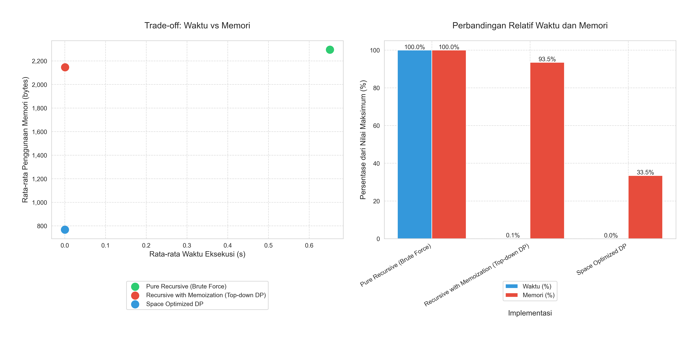
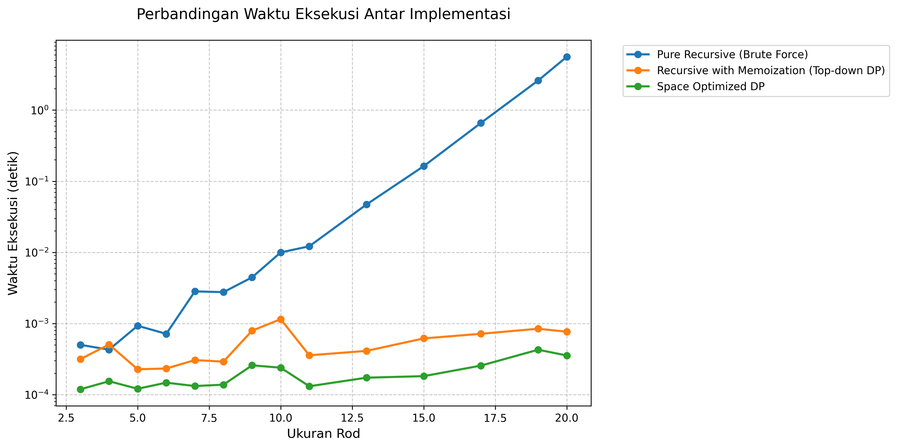
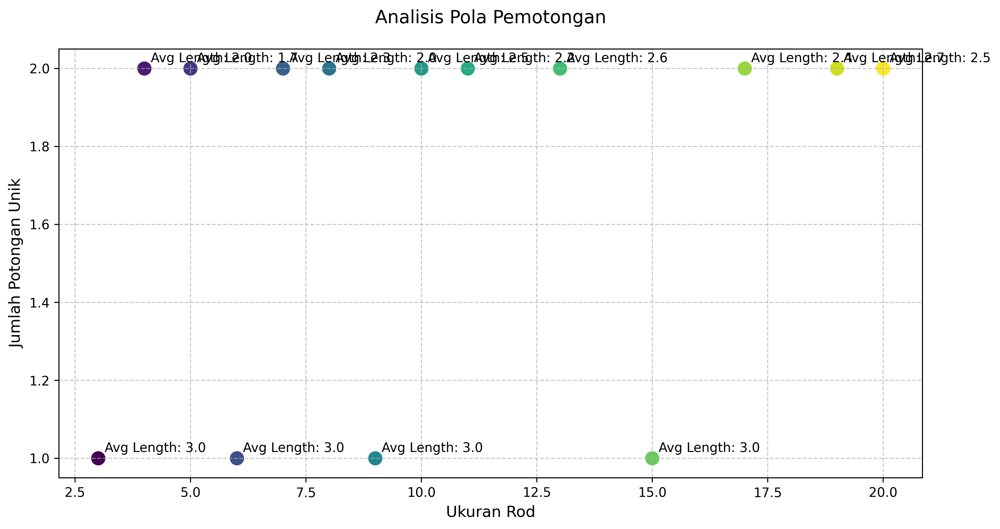
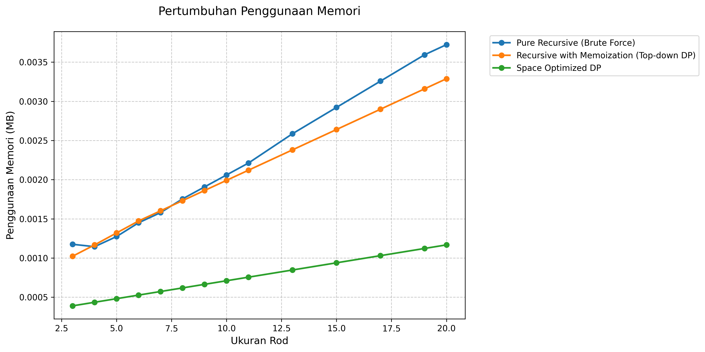
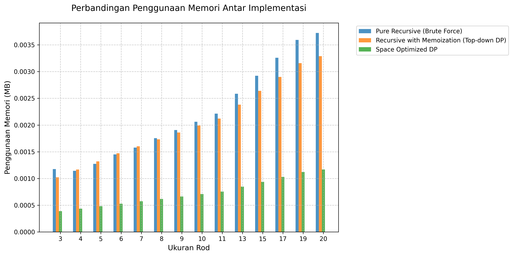

# Analisis Rod Cutting Problem

### Tanggal Pengujian: 2024-12-21 02:41:27

## Kategorisasi Implementasi

### 1. Implementasi Tanpa Dynamic Programming (Brute Force)

#### Pure Recursive
- Menggunakan rekursi murni tanpa optimasi
- Menghitung ulang subproblem yang sama berkali-kali
- Kompleksitas Waktu: O(2^n)
- Kompleksitas Ruang: O(n) untuk call stack

### 2. Implementasi dengan Dynamic Programming

#### Recursive dengan Memoization (Top-down DP)
- Menggunakan DP dengan pendekatan top-down
- Menyimpan hasil perhitungan dalam dictionary
- Kompleksitas Waktu: O(n²)
- Trade-off antara waktu dan memori

#### Space Optimized DP
- Menggunakan DP dengan pendekatan bottom-up
- Membangun solusi dari subproblem terkecil
- Mengoptimalkan penggunaan memori
- Kompleksitas Waktu: O(n²)
- Overhead memori minimal

## Hasil Pengujian Detail

### Daftar Panjang:
```
[3, 4, 5, 6, 7, 8, 9, 10, 11, 13, 15, 17, 19, 20]
```

**Daftar Harga:**
```
[1363, 2708, 4238, 5413, 5746, 7722, 9793, 10126, 10459, 10792, 11125, 11458, 12705, 13038, 13371, 14509, 16123, 16456, 18012, 18345]
```

**Analisis Harga per Unit:**
```
  Panjang 1: 1363.00 per unit
  Panjang 2: 1354.00 per unit
  Panjang 3: 1412.67 per unit ⭐ (optimal per unit)
  Panjang 4: 1353.25 per unit
  Panjang 5: 1149.20 per unit
  Panjang 6: 1287.00 per unit
  Panjang 7: 1399.00 per unit
  Panjang 8: 1265.75 per unit
  Panjang 9: 1162.11 per unit
  Panjang 10: 1079.20 per unit
  Panjang 11: 1011.36 per unit
  Panjang 12: 954.83 per unit
  Panjang 13: 977.31 per unit
  Panjang 14: 931.29 per unit
  Panjang 15: 891.40 per unit
  Panjang 16: 906.81 per unit
  Panjang 17: 948.41 per unit
  Panjang 18: 914.22 per unit
  Panjang 19: 948.00 per unit
  Panjang 20: 917.25 per unit
```

## Perbandingan Kinerja
### Waktu Eksekusi
| Size | Pure Recursive (Brute Force) | Recursive with Memoization (Top-down DP) | Space Optimized DP |
|---|---|---|---|
| 3 | 0.000501s | 0.000316s | 0.000119s |
| 4 | 0.000429s | 0.000506s | 0.000154s |
| 5 | 0.000930s | 0.000227s | 0.000121s |
| 6 | 0.000715s | 0.000233s | 0.000147s |
| 7 | 0.002828s | 0.000306s | 0.000132s |
| 8 | 0.002759s | 0.000291s | 0.000138s |
| 9 | 0.004457s | 0.000792s | 0.000258s |
| 10 | 0.009979s | 0.001151s | 0.000239s |
| 11 | 0.012176s | 0.000357s | 0.000131s |
| 13 | 0.047115s | 0.000412s | 0.000173s |
| 15 | 0.162917s | 0.000617s | 0.000182s |
| 17 | 0.660152s | 0.000717s | 0.000256s |
| 19 | 2.603945s | 0.000844s | 0.000428s |
| 20 | 5.605822s | 0.000766s | 0.000355s |

### Analisis Peningkatan Waktu

#### Peningkatan dari ukuran 3 ke 10:
- Pure Recursive (Brute Force): 1892.15% 
- Recursive with Memoization (Top-down DP): 264.03% 
- Space Optimized DP: 101.00% 

#### Peningkatan dari ukuran 10 ke 20:
- Pure Recursive (Brute Force): 56076.14% 
- Recursive with Memoization (Top-down DP): -33.46% 
- Space Optimized DP: 48.45% 

### Penggunaan Memori
| Size | Pure Recursive (Brute Force) | Recursive with Memoization (Top-down DP) | Space Optimized DP |
|---|---|---|---|
| 3 | 1.20 KB | 1.05 KB | 408.00 bytes |
| 4 | 1.17 KB | 1.20 KB | 456.00 bytes |
| 5 | 1.30 KB | 1.35 KB | 504.00 bytes |
| 6 | 1.48 KB | 1.51 KB | 552.00 bytes |
| 7 | 1.62 KB | 1.64 KB | 600.00 bytes |
| 8 | 1.80 KB | 1.77 KB | 648.00 bytes |
| 9 | 1.95 KB | 1.91 KB | 696.00 bytes |
| 10 | 2.11 KB | 2.04 KB | 744.00 bytes |
| 11 | 2.27 KB | 2.17 KB | 792.00 bytes |
| 13 | 2.65 KB | 2.44 KB | 888.00 bytes |
| 15 | 2.99 KB | 2.70 KB | 984.00 bytes |
| 17 | 3.34 KB | 2.97 KB | 1.05 KB |
| 19 | 3.68 KB | 3.23 KB | 1.15 KB |
| 20 | 3.81 KB | 3.37 KB | 1.20 KB |

## Analisis Hasil
### Nilai Optimal dan Pola Pemotongan
| Size | Pure Recursive (Brute Force) | Recursive with Memoization (Top-down DP) | Space Optimized DP |
|---|---|---|---|
| 3 | 4238 ([3]) | 4238 ([3]) | 4238 ([3]) |
| 4 | 5601 ([1, 3]) | 5601 ([1, 3]) | 5601 ([1, 3]) |
| 5 | 6964 ([1, 1, 3]) | 6964 ([1, 1, 3]) | 6964 ([1, 1, 3]) |
| 6 | 8476 ([3, 3]) | 8476 ([3, 3]) | 8476 ([3, 3]) |
| 7 | 9839 ([1, 3, 3]) | 9839 ([1, 3, 3]) | 9839 ([1, 3, 3]) |
| 8 | 11202 ([1, 1, 3, 3]) | 11202 ([1, 1, 3, 3]) | 11202 ([1, 1, 3, 3]) |
| 9 | 12714 ([3, 3, 3]) | 12714 ([3, 3, 3]) | 12714 ([3, 3, 3]) |
| 10 | 14077 ([1, 3, 3, 3]) | 14077 ([1, 3, 3, 3]) | 14077 ([1, 3, 3, 3]) |
| 11 | 15440 ([1, 1, 3, 3, 3]) | 15440 ([1, 1, 3, 3, 3]) | 15440 ([1, 1, 3, 3, 3]) |
| 13 | 18315 ([1, 3, 3, 3, 3]) | 18315 ([1, 3, 3, 3, 3]) | 18315 ([1, 3, 3, 3, 3]) |
| 15 | 21190 ([3, 3, 3, 3, 3]) | 21190 ([3, 3, 3, 3, 3]) | 21190 ([3, 3, 3, 3, 3]) |
| 17 | 23916 ([1, 1, 3, 3, 3, 3, 3]) | 23916 ([1, 1, 3, 3, 3, 3, 3]) | 23916 ([1, 1, 3, 3, 3, 3, 3]) |
| 19 | 26791 ([1, 3, 3, 3, 3, 3, 3]) | 26791 ([1, 3, 3, 3, 3, 3, 3]) | 26791 ([1, 3, 3, 3, 3, 3, 3]) |
| 20 | 28154 ([1, 1, 3, 3, 3, 3, 3, 3]) | 28154 ([1, 1, 3, 3, 3, 3, 3, 3]) | 28154 ([1, 1, 3, 3, 3, 3, 3, 3]) |

### Analisis Efisiensi Detail

#### Size 3

**Pure Recursive (Brute Force)**
- Nilai Total: 4238
- Pola Potong: [3]
- Harga per Unit: 1412.67
- Efisiensi vs No Cut: 0.0%
- Detail perhitungan:
```
  Panjang 3 (x1): 4238 (per unit: 1412.67)
  Total: 4238
```

**Recursive with Memoization (Top-down DP)**
- Nilai Total: 4238
- Pola Potong: [3]
- Harga per Unit: 1412.67
- Efisiensi vs No Cut: 0.0%
- Detail perhitungan:
```
  Panjang 3 (x1): 4238 (per unit: 1412.67)
  Total: 4238
```

**Space Optimized DP**
- Nilai Total: 4238
- Pola Potong: [3]
- Harga per Unit: 1412.67
- Efisiensi vs No Cut: 0.0%
- Detail perhitungan:
```
  Panjang 3 (x1): 4238 (per unit: 1412.67)
  Total: 4238
```

#### Size 4

**Pure Recursive (Brute Force)**
- Nilai Total: 5601
- Pola Potong: [1, 3]
- Harga per Unit: 1400.25
- Efisiensi vs No Cut: 3.5%
- Detail perhitungan:
```
  Panjang 1 (x1): 1363 (per unit: 1363.00)
  Panjang 3 (x1): 4238 (per unit: 1412.67)
  Total: 5601
```

**Recursive with Memoization (Top-down DP)**
- Nilai Total: 5601
- Pola Potong: [1, 3]
- Harga per Unit: 1400.25
- Efisiensi vs No Cut: 3.5%
- Detail perhitungan:
```
  Panjang 1 (x1): 1363 (per unit: 1363.00)
  Panjang 3 (x1): 4238 (per unit: 1412.67)
  Total: 5601
```

**Space Optimized DP**
- Nilai Total: 5601
- Pola Potong: [1, 3]
- Harga per Unit: 1400.25
- Efisiensi vs No Cut: 3.5%
- Detail perhitungan:
```
  Panjang 1 (x1): 1363 (per unit: 1363.00)
  Panjang 3 (x1): 4238 (per unit: 1412.67)
  Total: 5601
```

#### Size 5

**Pure Recursive (Brute Force)**
- Nilai Total: 6964
- Pola Potong: [1, 1, 3]
- Harga per Unit: 1392.80
- Efisiensi vs No Cut: 21.2%
- Detail perhitungan:
```
  Panjang 1 (x2): 1363 (per unit: 1363.00)
  Panjang 3 (x1): 4238 (per unit: 1412.67)
  Total: 6964
```

**Recursive with Memoization (Top-down DP)**
- Nilai Total: 6964
- Pola Potong: [1, 1, 3]
- Harga per Unit: 1392.80
- Efisiensi vs No Cut: 21.2%
- Detail perhitungan:
```
  Panjang 1 (x2): 1363 (per unit: 1363.00)
  Panjang 3 (x1): 4238 (per unit: 1412.67)
  Total: 6964
```

**Space Optimized DP**
- Nilai Total: 6964
- Pola Potong: [1, 1, 3]
- Harga per Unit: 1392.80
- Efisiensi vs No Cut: 21.2%
- Detail perhitungan:
```
  Panjang 1 (x2): 1363 (per unit: 1363.00)
  Panjang 3 (x1): 4238 (per unit: 1412.67)
  Total: 6964
```

#### Size 6

**Pure Recursive (Brute Force)**
- Nilai Total: 8476
- Pola Potong: [3, 3]
- Harga per Unit: 1412.67
- Efisiensi vs No Cut: 9.8%
- Detail perhitungan:
```
  Panjang 3 (x2): 4238 (per unit: 1412.67)
  Total: 8476
```

**Recursive with Memoization (Top-down DP)**
- Nilai Total: 8476
- Pola Potong: [3, 3]
- Harga per Unit: 1412.67
- Efisiensi vs No Cut: 9.8%
- Detail perhitungan:
```
  Panjang 3 (x2): 4238 (per unit: 1412.67)
  Total: 8476
```

**Space Optimized DP**
- Nilai Total: 8476
- Pola Potong: [3, 3]
- Harga per Unit: 1412.67
- Efisiensi vs No Cut: 9.8%
- Detail perhitungan:
```
  Panjang 3 (x2): 4238 (per unit: 1412.67)
  Total: 8476
```

#### Size 7

**Pure Recursive (Brute Force)**
- Nilai Total: 9839
- Pola Potong: [1, 3, 3]
- Harga per Unit: 1405.57
- Efisiensi vs No Cut: 0.5%
- Detail perhitungan:
```
  Panjang 1 (x1): 1363 (per unit: 1363.00)
  Panjang 3 (x2): 4238 (per unit: 1412.67)
  Total: 9839
```

**Recursive with Memoization (Top-down DP)**
- Nilai Total: 9839
- Pola Potong: [1, 3, 3]
- Harga per Unit: 1405.57
- Efisiensi vs No Cut: 0.5%
- Detail perhitungan:
```
  Panjang 1 (x1): 1363 (per unit: 1363.00)
  Panjang 3 (x2): 4238 (per unit: 1412.67)
  Total: 9839
```

**Space Optimized DP**
- Nilai Total: 9839
- Pola Potong: [1, 3, 3]
- Harga per Unit: 1405.57
- Efisiensi vs No Cut: 0.5%
- Detail perhitungan:
```
  Panjang 1 (x1): 1363 (per unit: 1363.00)
  Panjang 3 (x2): 4238 (per unit: 1412.67)
  Total: 9839
```

#### Size 8

**Pure Recursive (Brute Force)**
- Nilai Total: 11202
- Pola Potong: [1, 1, 3, 3]
- Harga per Unit: 1400.25
- Efisiensi vs No Cut: 10.6%
- Detail perhitungan:
```
  Panjang 1 (x2): 1363 (per unit: 1363.00)
  Panjang 3 (x2): 4238 (per unit: 1412.67)
  Total: 11202
```

**Recursive with Memoization (Top-down DP)**
- Nilai Total: 11202
- Pola Potong: [1, 1, 3, 3]
- Harga per Unit: 1400.25
- Efisiensi vs No Cut: 10.6%
- Detail perhitungan:
```
  Panjang 1 (x2): 1363 (per unit: 1363.00)
  Panjang 3 (x2): 4238 (per unit: 1412.67)
  Total: 11202
```

**Space Optimized DP**
- Nilai Total: 11202
- Pola Potong: [1, 1, 3, 3]
- Harga per Unit: 1400.25
- Efisiensi vs No Cut: 10.6%
- Detail perhitungan:
```
  Panjang 1 (x2): 1363 (per unit: 1363.00)
  Panjang 3 (x2): 4238 (per unit: 1412.67)
  Total: 11202
```

#### Size 9

**Pure Recursive (Brute Force)**
- Nilai Total: 12714
- Pola Potong: [3, 3, 3]
- Harga per Unit: 1412.67
- Efisiensi vs No Cut: 21.6%
- Detail perhitungan:
```
  Panjang 3 (x3): 4238 (per unit: 1412.67)
  Total: 12714
```

**Recursive with Memoization (Top-down DP)**
- Nilai Total: 12714
- Pola Potong: [3, 3, 3]
- Harga per Unit: 1412.67
- Efisiensi vs No Cut: 21.6%
- Detail perhitungan:
```
  Panjang 3 (x3): 4238 (per unit: 1412.67)
  Total: 12714
```

**Space Optimized DP**
- Nilai Total: 12714
- Pola Potong: [3, 3, 3]
- Harga per Unit: 1412.67
- Efisiensi vs No Cut: 21.6%
- Detail perhitungan:
```
  Panjang 3 (x3): 4238 (per unit: 1412.67)
  Total: 12714
```

#### Size 10

**Pure Recursive (Brute Force)**
- Nilai Total: 14077
- Pola Potong: [1, 3, 3, 3]
- Harga per Unit: 1407.70
- Efisiensi vs No Cut: 30.4%
- Detail perhitungan:
```
  Panjang 1 (x1): 1363 (per unit: 1363.00)
  Panjang 3 (x3): 4238 (per unit: 1412.67)
  Total: 14077
```

**Recursive with Memoization (Top-down DP)**
- Nilai Total: 14077
- Pola Potong: [1, 3, 3, 3]
- Harga per Unit: 1407.70
- Efisiensi vs No Cut: 30.4%
- Detail perhitungan:
```
  Panjang 1 (x1): 1363 (per unit: 1363.00)
  Panjang 3 (x3): 4238 (per unit: 1412.67)
  Total: 14077
```

**Space Optimized DP**
- Nilai Total: 14077
- Pola Potong: [1, 3, 3, 3]
- Harga per Unit: 1407.70
- Efisiensi vs No Cut: 30.4%
- Detail perhitungan:
```
  Panjang 1 (x1): 1363 (per unit: 1363.00)
  Panjang 3 (x3): 4238 (per unit: 1412.67)
  Total: 14077
```

#### Size 11

**Pure Recursive (Brute Force)**
- Nilai Total: 15440
- Pola Potong: [1, 1, 3, 3, 3]
- Harga per Unit: 1403.64
- Efisiensi vs No Cut: 38.8%
- Detail perhitungan:
```
  Panjang 1 (x2): 1363 (per unit: 1363.00)
  Panjang 3 (x3): 4238 (per unit: 1412.67)
  Total: 15440
```

**Recursive with Memoization (Top-down DP)**
- Nilai Total: 15440
- Pola Potong: [1, 1, 3, 3, 3]
- Harga per Unit: 1403.64
- Efisiensi vs No Cut: 38.8%
- Detail perhitungan:
```
  Panjang 1 (x2): 1363 (per unit: 1363.00)
  Panjang 3 (x3): 4238 (per unit: 1412.67)
  Total: 15440
```

**Space Optimized DP**
- Nilai Total: 15440
- Pola Potong: [1, 1, 3, 3, 3]
- Harga per Unit: 1403.64
- Efisiensi vs No Cut: 38.8%
- Detail perhitungan:
```
  Panjang 1 (x2): 1363 (per unit: 1363.00)
  Panjang 3 (x3): 4238 (per unit: 1412.67)
  Total: 15440
```

#### Size 13

**Pure Recursive (Brute Force)**
- Nilai Total: 18315
- Pola Potong: [1, 3, 3, 3, 3]
- Harga per Unit: 1408.85
- Efisiensi vs No Cut: 44.2%
- Detail perhitungan:
```
  Panjang 1 (x1): 1363 (per unit: 1363.00)
  Panjang 3 (x4): 4238 (per unit: 1412.67)
  Total: 18315
```

**Recursive with Memoization (Top-down DP)**
- Nilai Total: 18315
- Pola Potong: [1, 3, 3, 3, 3]
- Harga per Unit: 1408.85
- Efisiensi vs No Cut: 44.2%
- Detail perhitungan:
```
  Panjang 1 (x1): 1363 (per unit: 1363.00)
  Panjang 3 (x4): 4238 (per unit: 1412.67)
  Total: 18315
```

**Space Optimized DP**
- Nilai Total: 18315
- Pola Potong: [1, 3, 3, 3, 3]
- Harga per Unit: 1408.85
- Efisiensi vs No Cut: 44.2%
- Detail perhitungan:
```
  Panjang 1 (x1): 1363 (per unit: 1363.00)
  Panjang 3 (x4): 4238 (per unit: 1412.67)
  Total: 18315
```

#### Size 15

**Pure Recursive (Brute Force)**
- Nilai Total: 21190
- Pola Potong: [3, 3, 3, 3, 3]
- Harga per Unit: 1412.67
- Efisiensi vs No Cut: 58.5%
- Detail perhitungan:
```
  Panjang 3 (x5): 4238 (per unit: 1412.67)
  Total: 21190
```

**Recursive with Memoization (Top-down DP)**
- Nilai Total: 21190
- Pola Potong: [3, 3, 3, 3, 3]
- Harga per Unit: 1412.67
- Efisiensi vs No Cut: 58.5%
- Detail perhitungan:
```
  Panjang 3 (x5): 4238 (per unit: 1412.67)
  Total: 21190
```

**Space Optimized DP**
- Nilai Total: 21190
- Pola Potong: [3, 3, 3, 3, 3]
- Harga per Unit: 1412.67
- Efisiensi vs No Cut: 58.5%
- Detail perhitungan:
```
  Panjang 3 (x5): 4238 (per unit: 1412.67)
  Total: 21190
```

#### Size 17

**Pure Recursive (Brute Force)**
- Nilai Total: 23916
- Pola Potong: [1, 1, 3, 3, 3, 3, 3]
- Harga per Unit: 1406.82
- Efisiensi vs No Cut: 48.3%
- Detail perhitungan:
```
  Panjang 1 (x2): 1363 (per unit: 1363.00)
  Panjang 3 (x5): 4238 (per unit: 1412.67)
  Total: 23916
```

**Recursive with Memoization (Top-down DP)**
- Nilai Total: 23916
- Pola Potong: [1, 1, 3, 3, 3, 3, 3]
- Harga per Unit: 1406.82
- Efisiensi vs No Cut: 48.3%
- Detail perhitungan:
```
  Panjang 1 (x2): 1363 (per unit: 1363.00)
  Panjang 3 (x5): 4238 (per unit: 1412.67)
  Total: 23916
```

**Space Optimized DP**
- Nilai Total: 23916
- Pola Potong: [1, 1, 3, 3, 3, 3, 3]
- Harga per Unit: 1406.82
- Efisiensi vs No Cut: 48.3%
- Detail perhitungan:
```
  Panjang 1 (x2): 1363 (per unit: 1363.00)
  Panjang 3 (x5): 4238 (per unit: 1412.67)
  Total: 23916
```

#### Size 19

**Pure Recursive (Brute Force)**
- Nilai Total: 26791
- Pola Potong: [1, 3, 3, 3, 3, 3, 3]
- Harga per Unit: 1410.05
- Efisiensi vs No Cut: 48.7%
- Detail perhitungan:
```
  Panjang 1 (x1): 1363 (per unit: 1363.00)
  Panjang 3 (x6): 4238 (per unit: 1412.67)
  Total: 26791
```

**Recursive with Memoization (Top-down DP)**
- Nilai Total: 26791
- Pola Potong: [1, 3, 3, 3, 3, 3, 3]
- Harga per Unit: 1410.05
- Efisiensi vs No Cut: 48.7%
- Detail perhitungan:
```
  Panjang 1 (x1): 1363 (per unit: 1363.00)
  Panjang 3 (x6): 4238 (per unit: 1412.67)
  Total: 26791
```

**Space Optimized DP**
- Nilai Total: 26791
- Pola Potong: [1, 3, 3, 3, 3, 3, 3]
- Harga per Unit: 1410.05
- Efisiensi vs No Cut: 48.7%
- Detail perhitungan:
```
  Panjang 1 (x1): 1363 (per unit: 1363.00)
  Panjang 3 (x6): 4238 (per unit: 1412.67)
  Total: 26791
```

#### Size 20

**Pure Recursive (Brute Force)**
- Nilai Total: 28154
- Pola Potong: [1, 1, 3, 3, 3, 3, 3, 3]
- Harga per Unit: 1407.70
- Efisiensi vs No Cut: 53.5%
- Detail perhitungan:
```
  Panjang 1 (x2): 1363 (per unit: 1363.00)
  Panjang 3 (x6): 4238 (per unit: 1412.67)
  Total: 28154
```

**Recursive with Memoization (Top-down DP)**
- Nilai Total: 28154
- Pola Potong: [1, 1, 3, 3, 3, 3, 3, 3]
- Harga per Unit: 1407.70
- Efisiensi vs No Cut: 53.5%
- Detail perhitungan:
```
  Panjang 1 (x2): 1363 (per unit: 1363.00)
  Panjang 3 (x6): 4238 (per unit: 1412.67)
  Total: 28154
```

**Space Optimized DP**
- Nilai Total: 28154
- Pola Potong: [1, 1, 3, 3, 3, 3, 3, 3]
- Harga per Unit: 1407.70
- Efisiensi vs No Cut: 53.5%
- Detail perhitungan:
```
  Panjang 1 (x2): 1363 (per unit: 1363.00)
  Panjang 3 (x6): 4238 (per unit: 1412.67)
  Total: 28154
```

## Analisis Trade-off


### Visualisasi Trade-off


### 1. Trade-off Waktu vs Memori

#### Pure Recursive (Brute Force)
- Rata-rata Waktu: 0.651052s
- Rata-rata Memori: 2.24 KB
- Waktu Maksimum: 5.605822s
- Memori Maksimum: 3.81 KB

#### Recursive with Memoization (Top-down DP)
- Rata-rata Waktu: 0.000538s
- Rata-rata Memori: 2.10 KB
- Waktu Maksimum: 0.001151s
- Memori Maksimum: 3.37 KB

#### Space Optimized DP
- Rata-rata Waktu: 0.000202s
- Rata-rata Memori: 768.00 bytes
- Waktu Maksimum: 0.000428s
- Memori Maksimum: 1.20 KB

### 2. Karakteristik Implementasi

#### Pure Recursive (Brute Force)
- **Kelebihan:**
  - Implementasi sederhana dan mudah dipahami
  - Cocok untuk debugging karena alur eksekusi jelas
- **Kekurangan:**
  - Waktu eksekusi meningkat eksponensial
  - Banyak perhitungan redundan
- **Best Case:** Input kecil (n ≤ 10) untuk pembelajaran

#### Recursive with Memoization (Top-down DP)
- **Kelebihan:**
  - Hanya menghitung subproblem yang diperlukan
  - Mudah diimplementasi dari versi rekursif
- **Kekurangan:**
  - Overhead dari rekursi masih ada
  - Penggunaan memori untuk memoization
- **Best Case:** Input menengah dengan subproblem berulang

#### Space Optimized DP
- **Kelebihan:**
  - Menghindari overhead rekursi
  - Penggunaan memori paling efisien
  - Kinerja waktu tetap kompetitif
- **Kekurangan:**
  - Implementasi lebih kompleks
  - Tracking solusi lebih sulit
- **Best Case:** Input besar dengan batasan memori ketat

### 3. Perbedaan Urutan Pemotongan

Beberapa implementasi menghasilkan urutan pemotongan yang berbeda (misalnya [2, 3] vs [3, 2]) karena:

1. **Arah Pencarian:**
   - Top-down: Memecah masalah dari atas ke bawah
   - Bottom-up: Membangun solusi dari bawah ke atas

2. **Prioritas Pemilihan:**
   - Beberapa implementasi mengutamakan potongan kecil dulu
   - Yang lain mengutamakan potongan besar dulu

3. **Urutan Iterasi:**
   - Iterative: Mencoba kombinasi secara sekuensial
   - DP: Mengoptimalkan berdasarkan subproblem

Semua urutan valid selama menghasilkan nilai optimal yang sama.

### 4. Rekomendasi Penggunaan Berdasarkan Karakteristik Input

#### Berdasarkan Ukuran Input
- **Kecil (n ≤ 10):**
  - Gunakan Pure Recursive untuk pembelajaran

- **Menengah (10 < n ≤ 20):**
  - Gunakan Top-down DP jika subproblem sedikit
  - Atau Bottom-up DP untuk konsistensi

- **Besar (n > 20):**
  - Gunakan Bottom-up DP untuk kinerja optimal
  - Atau Space Optimized DP jika memori terbatas

#### Berdasarkan Batasan Panjang Potong
- **Sedikit Pilihan:**
  - Top-down DP lebih efisien karena subproblem lebih sedikit

- **Banyak Pilihan:**
  - Bottom-up DP atau Space Optimized DP untuk konsistensi

#### Berdasarkan Kebutuhan Debugging
- **Fase Development:**
  - Gunakan Pure Recursive atau Top-down DP
  - Lebih mudah di-debug dan dipahami

- **Fase Production:**
  - Gunakan Bottom-up DP atau Space Optimized DP
  - Performa dan efisiensi lebih penting


## Visualisasi
### 1. Perbandingan Waktu Eksekusi


Berdasarkan data pengujian dengan ukuran input [3, 4, 5, 6, 7, 8, 9, 10, 11, 13, 15, 17, 19, 20]:
- **Waktu Eksekusi Terbaik:**
  - Space Optimized DP: 0.000119s
  - Recursive with Memoization (Top-down DP): 0.000227s
  - Pure Recursive (Brute Force): 0.000429s

- **Waktu Eksekusi Terburuk:**
  - Pure Recursive (Brute Force): 5.605822s
  - Recursive with Memoization (Top-down DP): 0.001151s
  - Space Optimized DP: 0.000428s

### 2. Analisis Pola Pemotongan
Hasil pola pemotongan untuk setiap ukuran input:



### 3. Visualisasi Penggunaan Memori
#### a. Grafik Pertumbuhan Memori


Pengukuran penggunaan memori:
- **Memori Minimum:**
  - Space Optimized DP: 408.00 bytes
  - Recursive with Memoization (Top-down DP): 1.05 KB
  - Pure Recursive (Brute Force): 1.17 KB

- **Memori Maksimum:**
  - Pure Recursive (Brute Force): 3.81 KB
  - Recursive with Memoization (Top-down DP): 3.37 KB
  - Space Optimized DP: 1.20 KB

#### b. Perbandingan Penggunaan Memori


Perbandingan relatif penggunaan memori:
- Pure Recursive (Brute Force) menggunakan 3.19x lebih banyak memori dibanding Space Optimized DP
- Recursive with Memoization (Top-down DP) menggunakan 2.82x lebih banyak memori dibanding Space Optimized DP

## Kesimpulan

### Performa Implementasi
1. **Performa Terbaik:** Space Optimized DP
2. **Performa Menengah:** Recursive with Memoization (Top-down DP)
3. **Performa Terendah:** Pure Recursive (Brute Force)

### Rekomendasi Penggunaan
1. Untuk dataset kecil (n ≤ 10): Semua implementasi dapat digunakan
2. Untuk dataset menengah (10 < n ≤ 20): Gunakan implementasi DP
3. Untuk dataset besar (n > 20): Gunakan Bottom-up Space Optimized DP
4. Jika memori terbatas: Gunakan Space Optimized DP
5. Untuk tujuan pembelajaran/debugging: Gunakan Rekursif / Top-down DP

