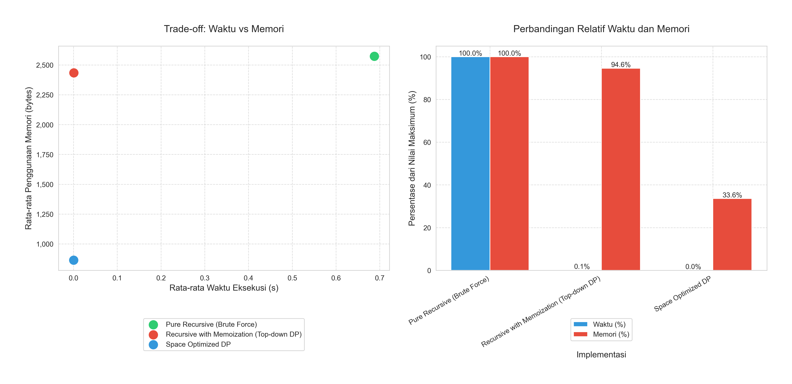
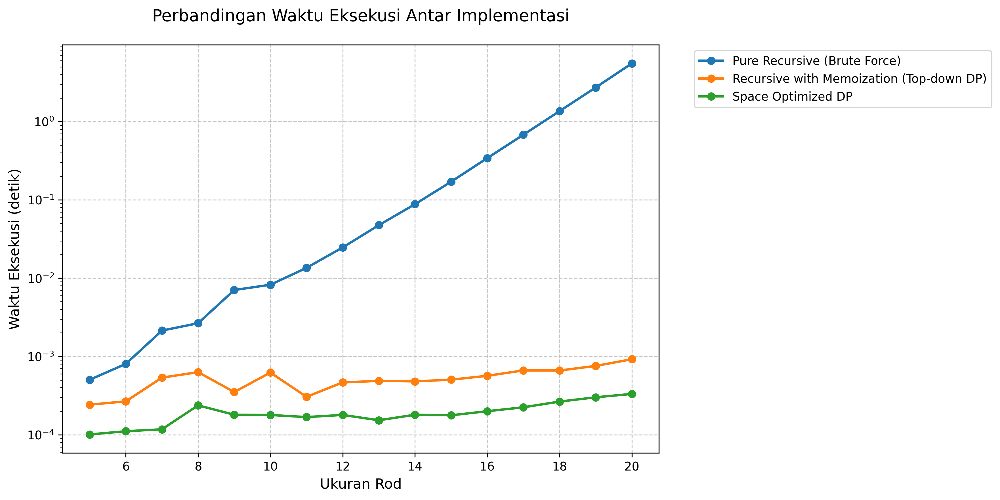
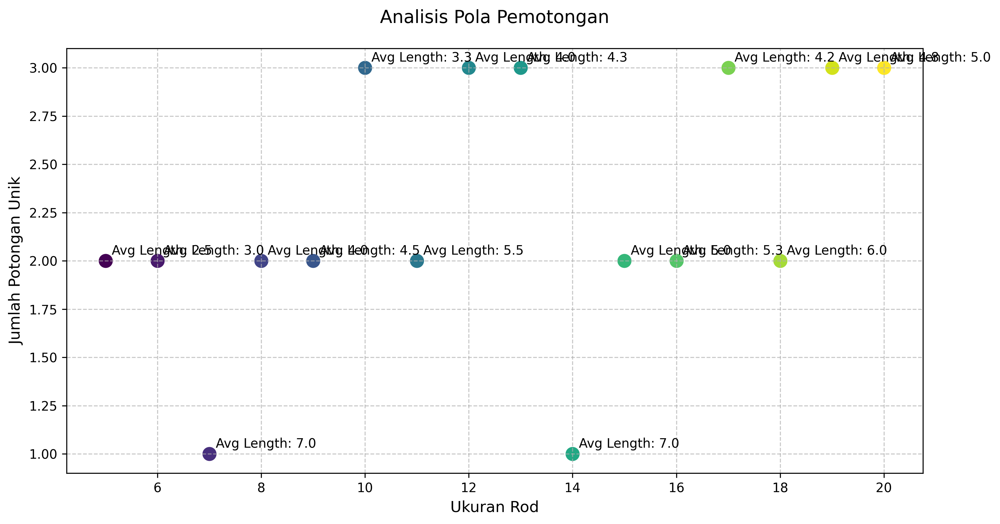
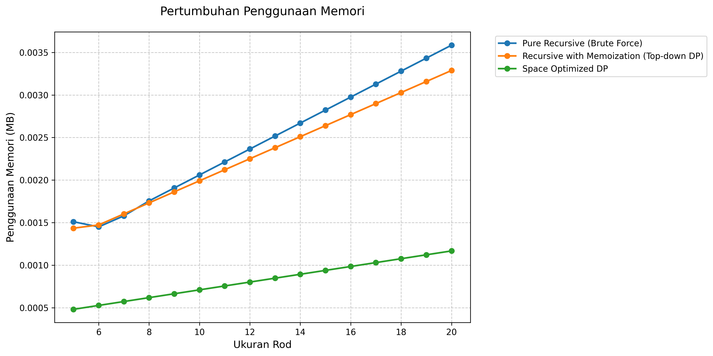
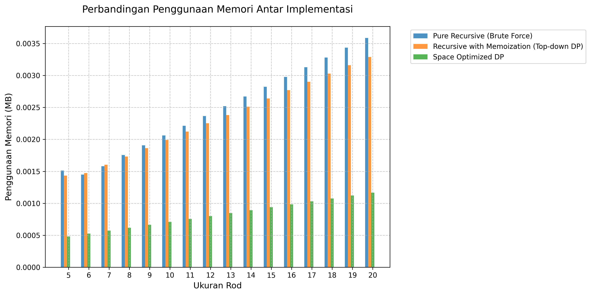

# Analisis Rod Cutting Problem

### Tanggal Pengujian: 2024-12-21 03:30:33

## Kategorisasi Implementasi

### 1. Implementasi Tanpa Dynamic Programming (Brute Force)

#### Pure Recursive
- Menggunakan rekursi murni tanpa optimasi
- Menghitung ulang subproblem yang sama berkali-kali
- Kompleksitas Waktu: O(2^n)
- Kompleksitas Ruang: O(n) untuk call stack

### 2. Implementasi dengan Dynamic Programming

#### Recursive dengan Memoization (Top-down DP)
- Menggunakan DP dengan pendekatan top-down
- Menyimpan hasil perhitungan dalam dictionary
- Kompleksitas Waktu: O(n²)
- Trade-off antara waktu dan memori

#### Space Optimized DP
- Menggunakan DP dengan pendekatan bottom-up
- Membangun solusi dari subproblem terkecil
- Mengoptimalkan penggunaan memori
- Kompleksitas Waktu: O(n²)
- Overhead memori minimal

## Hasil Pengujian Detail

### Daftar Panjang:
```
[5, 6, 7, 8, 9, 10, 11, 12, 13, 14, 15, 16, 17, 18, 19, 20]
```

**Daftar Harga:**
```
[1338, 2747, 4030, 5510, 5843, 8163, 9857, 10190, 10523, 10856, 11189, 11522, 12133, 12918, 13320, 14251, 16487, 16820, 18306, 18639]
```

**Analisis Harga per Unit:**
```
  Panjang 1: 1338.00 per unit
  Panjang 2: 1373.50 per unit
  Panjang 3: 1343.33 per unit
  Panjang 4: 1377.50 per unit
  Panjang 5: 1168.60 per unit
  Panjang 6: 1360.50 per unit
  Panjang 7: 1408.14 per unit ⭐ (optimal per unit)
  Panjang 8: 1273.75 per unit
  Panjang 9: 1169.22 per unit
  Panjang 10: 1085.60 per unit
  Panjang 11: 1017.18 per unit
  Panjang 12: 960.17 per unit
  Panjang 13: 933.31 per unit
  Panjang 14: 922.71 per unit
  Panjang 15: 888.00 per unit
  Panjang 16: 890.69 per unit
  Panjang 17: 969.82 per unit
  Panjang 18: 934.44 per unit
  Panjang 19: 963.47 per unit
  Panjang 20: 931.95 per unit
```

## Perbandingan Kinerja
### Waktu Eksekusi
| Size | Pure Recursive (Brute Force) | Recursive with Memoization (Top-down DP) | Space Optimized DP |
|---|---|---|---|
| 5 | 0.000504s | 0.000242s | 0.000101s |
| 6 | 0.000803s | 0.000267s | 0.000111s |
| 7 | 0.002139s | 0.000536s | 0.000117s |
| 8 | 0.002656s | 0.000630s | 0.000237s |
| 9 | 0.007053s | 0.000351s | 0.000180s |
| 10 | 0.008240s | 0.000623s | 0.000179s |
| 11 | 0.013538s | 0.000305s | 0.000168s |
| 12 | 0.024683s | 0.000466s | 0.000179s |
| 13 | 0.047518s | 0.000487s | 0.000153s |
| 14 | 0.088031s | 0.000480s | 0.000180s |
| 15 | 0.170518s | 0.000505s | 0.000177s |
| 16 | 0.341204s | 0.000566s | 0.000200s |
| 17 | 0.679741s | 0.000663s | 0.000224s |
| 18 | 1.359770s | 0.000661s | 0.000265s |
| 19 | 2.726838s | 0.000757s | 0.000301s |
| 20 | 5.529937s | 0.000921s | 0.000332s |

### Analisis Peningkatan Waktu

#### Peningkatan dari ukuran 5 ke 13:
- Pure Recursive (Brute Force): 9327.81% 
- Recursive with Memoization (Top-down DP): 101.28% 
- Space Optimized DP: 51.77% 

#### Peningkatan dari ukuran 13 ke 20:
- Pure Recursive (Brute Force): 11537.62% 
- Recursive with Memoization (Top-down DP): 89.04% 
- Space Optimized DP: 116.98% 

### Penggunaan Memori
| Size | Pure Recursive (Brute Force) | Recursive with Memoization (Top-down DP) | Space Optimized DP |
|---|---|---|---|
| 5 | 1.55 KB | 1.47 KB | 504.00 bytes |
| 6 | 1.48 KB | 1.51 KB | 552.00 bytes |
| 7 | 1.62 KB | 1.64 KB | 600.00 bytes |
| 8 | 1.80 KB | 1.77 KB | 648.00 bytes |
| 9 | 1.95 KB | 1.91 KB | 696.00 bytes |
| 10 | 2.11 KB | 2.04 KB | 744.00 bytes |
| 11 | 2.27 KB | 2.17 KB | 792.00 bytes |
| 12 | 2.42 KB | 2.30 KB | 840.00 bytes |
| 13 | 2.58 KB | 2.44 KB | 888.00 bytes |
| 14 | 2.73 KB | 2.57 KB | 936.00 bytes |
| 15 | 2.89 KB | 2.70 KB | 984.00 bytes |
| 16 | 3.05 KB | 2.84 KB | 1.01 KB |
| 17 | 3.20 KB | 2.97 KB | 1.05 KB |
| 18 | 3.36 KB | 3.10 KB | 1.10 KB |
| 19 | 3.52 KB | 3.23 KB | 1.15 KB |
| 20 | 3.67 KB | 3.37 KB | 1.20 KB |

## Analisis Hasil
### Nilai Optimal dan Pola Pemotongan
| Size | Pure Recursive (Brute Force) | Recursive with Memoization (Top-down DP) | Space Optimized DP |
|---|---|---|---|
| 5 | 6848 ([1, 4]) | 6848 ([1, 4]) | 6848 ([1, 4]) |
| 6 | 8257 ([2, 4]) | 8257 ([2, 4]) | 8257 ([2, 4]) |
| 7 | 9857 ([7]) | 9857 ([7]) | 9857 ([7]) |
| 8 | 11195 ([1, 7]) | 11195 ([1, 7]) | 11195 ([1, 7]) |
| 9 | 12604 ([2, 7]) | 12604 ([2, 7]) | 12604 ([2, 7]) |
| 10 | 13942 ([1, 2, 7]) | 13942 ([1, 2, 7]) | 13942 ([1, 2, 7]) |
| 11 | 15367 ([4, 7]) | 15367 ([4, 7]) | 15367 ([4, 7]) |
| 12 | 16705 ([1, 4, 7]) | 16705 ([1, 4, 7]) | 16705 ([1, 4, 7]) |
| 13 | 18114 ([2, 4, 7]) | 18114 ([2, 4, 7]) | 18114 ([2, 4, 7]) |
| 14 | 19714 ([7, 7]) | 19714 ([7, 7]) | 19714 ([7, 7]) |
| 15 | 21052 ([1, 7, 7]) | 21052 ([1, 7, 7]) | 21052 ([1, 7, 7]) |
| 16 | 22461 ([2, 7, 7]) | 22461 ([2, 7, 7]) | 22461 ([2, 7, 7]) |
| 17 | 23799 ([1, 2, 7, 7]) | 23799 ([1, 2, 7, 7]) | 23799 ([1, 2, 7, 7]) |
| 18 | 25224 ([4, 7, 7]) | 25224 ([4, 7, 7]) | 25224 ([4, 7, 7]) |
| 19 | 26562 ([1, 4, 7, 7]) | 26562 ([1, 4, 7, 7]) | 26562 ([1, 4, 7, 7]) |
| 20 | 27971 ([2, 4, 7, 7]) | 27971 ([2, 4, 7, 7]) | 27971 ([2, 4, 7, 7]) |

### Analisis Efisiensi Detail

#### Size 5

**Pure Recursive (Brute Force)**
- Nilai Total: 6848
- Pola Potong: [1, 4]
- Harga per Unit: 1369.60
- Efisiensi vs No Cut: 17.2%
- Detail perhitungan:
```
  Panjang 1 (x1): 1338 (per unit: 1338.00)
  Panjang 4 (x1): 5510 (per unit: 1377.50)
  Total: 6848
```

**Recursive with Memoization (Top-down DP)**
- Nilai Total: 6848
- Pola Potong: [1, 4]
- Harga per Unit: 1369.60
- Efisiensi vs No Cut: 17.2%
- Detail perhitungan:
```
  Panjang 1 (x1): 1338 (per unit: 1338.00)
  Panjang 4 (x1): 5510 (per unit: 1377.50)
  Total: 6848
```

**Space Optimized DP**
- Nilai Total: 6848
- Pola Potong: [1, 4]
- Harga per Unit: 1369.60
- Efisiensi vs No Cut: 17.2%
- Detail perhitungan:
```
  Panjang 1 (x1): 1338 (per unit: 1338.00)
  Panjang 4 (x1): 5510 (per unit: 1377.50)
  Total: 6848
```

#### Size 6

**Pure Recursive (Brute Force)**
- Nilai Total: 8257
- Pola Potong: [2, 4]
- Harga per Unit: 1376.17
- Efisiensi vs No Cut: 1.2%
- Detail perhitungan:
```
  Panjang 2 (x1): 2747 (per unit: 1373.50)
  Panjang 4 (x1): 5510 (per unit: 1377.50)
  Total: 8257
```

**Recursive with Memoization (Top-down DP)**
- Nilai Total: 8257
- Pola Potong: [2, 4]
- Harga per Unit: 1376.17
- Efisiensi vs No Cut: 1.2%
- Detail perhitungan:
```
  Panjang 2 (x1): 2747 (per unit: 1373.50)
  Panjang 4 (x1): 5510 (per unit: 1377.50)
  Total: 8257
```

**Space Optimized DP**
- Nilai Total: 8257
- Pola Potong: [2, 4]
- Harga per Unit: 1376.17
- Efisiensi vs No Cut: 1.2%
- Detail perhitungan:
```
  Panjang 2 (x1): 2747 (per unit: 1373.50)
  Panjang 4 (x1): 5510 (per unit: 1377.50)
  Total: 8257
```

#### Size 7

**Pure Recursive (Brute Force)**
- Nilai Total: 9857
- Pola Potong: [7]
- Harga per Unit: 1408.14
- Efisiensi vs No Cut: 0.0%
- Detail perhitungan:
```
  Panjang 7 (x1): 9857 (per unit: 1408.14)
  Total: 9857
```

**Recursive with Memoization (Top-down DP)**
- Nilai Total: 9857
- Pola Potong: [7]
- Harga per Unit: 1408.14
- Efisiensi vs No Cut: 0.0%
- Detail perhitungan:
```
  Panjang 7 (x1): 9857 (per unit: 1408.14)
  Total: 9857
```

**Space Optimized DP**
- Nilai Total: 9857
- Pola Potong: [7]
- Harga per Unit: 1408.14
- Efisiensi vs No Cut: 0.0%
- Detail perhitungan:
```
  Panjang 7 (x1): 9857 (per unit: 1408.14)
  Total: 9857
```

#### Size 8

**Pure Recursive (Brute Force)**
- Nilai Total: 11195
- Pola Potong: [1, 7]
- Harga per Unit: 1399.38
- Efisiensi vs No Cut: 9.9%
- Detail perhitungan:
```
  Panjang 1 (x1): 1338 (per unit: 1338.00)
  Panjang 7 (x1): 9857 (per unit: 1408.14)
  Total: 11195
```

**Recursive with Memoization (Top-down DP)**
- Nilai Total: 11195
- Pola Potong: [1, 7]
- Harga per Unit: 1399.38
- Efisiensi vs No Cut: 9.9%
- Detail perhitungan:
```
  Panjang 1 (x1): 1338 (per unit: 1338.00)
  Panjang 7 (x1): 9857 (per unit: 1408.14)
  Total: 11195
```

**Space Optimized DP**
- Nilai Total: 11195
- Pola Potong: [1, 7]
- Harga per Unit: 1399.38
- Efisiensi vs No Cut: 9.9%
- Detail perhitungan:
```
  Panjang 1 (x1): 1338 (per unit: 1338.00)
  Panjang 7 (x1): 9857 (per unit: 1408.14)
  Total: 11195
```

#### Size 9

**Pure Recursive (Brute Force)**
- Nilai Total: 12604
- Pola Potong: [2, 7]
- Harga per Unit: 1400.44
- Efisiensi vs No Cut: 19.8%
- Detail perhitungan:
```
  Panjang 2 (x1): 2747 (per unit: 1373.50)
  Panjang 7 (x1): 9857 (per unit: 1408.14)
  Total: 12604
```

**Recursive with Memoization (Top-down DP)**
- Nilai Total: 12604
- Pola Potong: [2, 7]
- Harga per Unit: 1400.44
- Efisiensi vs No Cut: 19.8%
- Detail perhitungan:
```
  Panjang 2 (x1): 2747 (per unit: 1373.50)
  Panjang 7 (x1): 9857 (per unit: 1408.14)
  Total: 12604
```

**Space Optimized DP**
- Nilai Total: 12604
- Pola Potong: [2, 7]
- Harga per Unit: 1400.44
- Efisiensi vs No Cut: 19.8%
- Detail perhitungan:
```
  Panjang 2 (x1): 2747 (per unit: 1373.50)
  Panjang 7 (x1): 9857 (per unit: 1408.14)
  Total: 12604
```

#### Size 10

**Pure Recursive (Brute Force)**
- Nilai Total: 13942
- Pola Potong: [1, 2, 7]
- Harga per Unit: 1394.20
- Efisiensi vs No Cut: 28.4%
- Detail perhitungan:
```
  Panjang 1 (x1): 1338 (per unit: 1338.00)
  Panjang 2 (x1): 2747 (per unit: 1373.50)
  Panjang 7 (x1): 9857 (per unit: 1408.14)
  Total: 13942
```

**Recursive with Memoization (Top-down DP)**
- Nilai Total: 13942
- Pola Potong: [1, 2, 7]
- Harga per Unit: 1394.20
- Efisiensi vs No Cut: 28.4%
- Detail perhitungan:
```
  Panjang 1 (x1): 1338 (per unit: 1338.00)
  Panjang 2 (x1): 2747 (per unit: 1373.50)
  Panjang 7 (x1): 9857 (per unit: 1408.14)
  Total: 13942
```

**Space Optimized DP**
- Nilai Total: 13942
- Pola Potong: [1, 2, 7]
- Harga per Unit: 1394.20
- Efisiensi vs No Cut: 28.4%
- Detail perhitungan:
```
  Panjang 1 (x1): 1338 (per unit: 1338.00)
  Panjang 2 (x1): 2747 (per unit: 1373.50)
  Panjang 7 (x1): 9857 (per unit: 1408.14)
  Total: 13942
```

#### Size 11

**Pure Recursive (Brute Force)**
- Nilai Total: 15367
- Pola Potong: [4, 7]
- Harga per Unit: 1397.00
- Efisiensi vs No Cut: 37.3%
- Detail perhitungan:
```
  Panjang 4 (x1): 5510 (per unit: 1377.50)
  Panjang 7 (x1): 9857 (per unit: 1408.14)
  Total: 15367
```

**Recursive with Memoization (Top-down DP)**
- Nilai Total: 15367
- Pola Potong: [4, 7]
- Harga per Unit: 1397.00
- Efisiensi vs No Cut: 37.3%
- Detail perhitungan:
```
  Panjang 4 (x1): 5510 (per unit: 1377.50)
  Panjang 7 (x1): 9857 (per unit: 1408.14)
  Total: 15367
```

**Space Optimized DP**
- Nilai Total: 15367
- Pola Potong: [4, 7]
- Harga per Unit: 1397.00
- Efisiensi vs No Cut: 37.3%
- Detail perhitungan:
```
  Panjang 4 (x1): 5510 (per unit: 1377.50)
  Panjang 7 (x1): 9857 (per unit: 1408.14)
  Total: 15367
```

#### Size 12

**Pure Recursive (Brute Force)**
- Nilai Total: 16705
- Pola Potong: [1, 4, 7]
- Harga per Unit: 1392.08
- Efisiensi vs No Cut: 45.0%
- Detail perhitungan:
```
  Panjang 1 (x1): 1338 (per unit: 1338.00)
  Panjang 4 (x1): 5510 (per unit: 1377.50)
  Panjang 7 (x1): 9857 (per unit: 1408.14)
  Total: 16705
```

**Recursive with Memoization (Top-down DP)**
- Nilai Total: 16705
- Pola Potong: [1, 4, 7]
- Harga per Unit: 1392.08
- Efisiensi vs No Cut: 45.0%
- Detail perhitungan:
```
  Panjang 1 (x1): 1338 (per unit: 1338.00)
  Panjang 4 (x1): 5510 (per unit: 1377.50)
  Panjang 7 (x1): 9857 (per unit: 1408.14)
  Total: 16705
```

**Space Optimized DP**
- Nilai Total: 16705
- Pola Potong: [1, 4, 7]
- Harga per Unit: 1392.08
- Efisiensi vs No Cut: 45.0%
- Detail perhitungan:
```
  Panjang 1 (x1): 1338 (per unit: 1338.00)
  Panjang 4 (x1): 5510 (per unit: 1377.50)
  Panjang 7 (x1): 9857 (per unit: 1408.14)
  Total: 16705
```

#### Size 13

**Pure Recursive (Brute Force)**
- Nilai Total: 18114
- Pola Potong: [2, 4, 7]
- Harga per Unit: 1393.38
- Efisiensi vs No Cut: 49.3%
- Detail perhitungan:
```
  Panjang 2 (x1): 2747 (per unit: 1373.50)
  Panjang 4 (x1): 5510 (per unit: 1377.50)
  Panjang 7 (x1): 9857 (per unit: 1408.14)
  Total: 18114
```

**Recursive with Memoization (Top-down DP)**
- Nilai Total: 18114
- Pola Potong: [2, 4, 7]
- Harga per Unit: 1393.38
- Efisiensi vs No Cut: 49.3%
- Detail perhitungan:
```
  Panjang 2 (x1): 2747 (per unit: 1373.50)
  Panjang 4 (x1): 5510 (per unit: 1377.50)
  Panjang 7 (x1): 9857 (per unit: 1408.14)
  Total: 18114
```

**Space Optimized DP**
- Nilai Total: 18114
- Pola Potong: [2, 4, 7]
- Harga per Unit: 1393.38
- Efisiensi vs No Cut: 49.3%
- Detail perhitungan:
```
  Panjang 2 (x1): 2747 (per unit: 1373.50)
  Panjang 4 (x1): 5510 (per unit: 1377.50)
  Panjang 7 (x1): 9857 (per unit: 1408.14)
  Total: 18114
```

#### Size 14

**Pure Recursive (Brute Force)**
- Nilai Total: 19714
- Pola Potong: [7, 7]
- Harga per Unit: 1408.14
- Efisiensi vs No Cut: 52.6%
- Detail perhitungan:
```
  Panjang 7 (x2): 9857 (per unit: 1408.14)
  Total: 19714
```

**Recursive with Memoization (Top-down DP)**
- Nilai Total: 19714
- Pola Potong: [7, 7]
- Harga per Unit: 1408.14
- Efisiensi vs No Cut: 52.6%
- Detail perhitungan:
```
  Panjang 7 (x2): 9857 (per unit: 1408.14)
  Total: 19714
```

**Space Optimized DP**
- Nilai Total: 19714
- Pola Potong: [7, 7]
- Harga per Unit: 1408.14
- Efisiensi vs No Cut: 52.6%
- Detail perhitungan:
```
  Panjang 7 (x2): 9857 (per unit: 1408.14)
  Total: 19714
```

#### Size 15

**Pure Recursive (Brute Force)**
- Nilai Total: 21052
- Pola Potong: [1, 7, 7]
- Harga per Unit: 1403.47
- Efisiensi vs No Cut: 58.0%
- Detail perhitungan:
```
  Panjang 1 (x1): 1338 (per unit: 1338.00)
  Panjang 7 (x2): 9857 (per unit: 1408.14)
  Total: 21052
```

**Recursive with Memoization (Top-down DP)**
- Nilai Total: 21052
- Pola Potong: [1, 7, 7]
- Harga per Unit: 1403.47
- Efisiensi vs No Cut: 58.0%
- Detail perhitungan:
```
  Panjang 1 (x1): 1338 (per unit: 1338.00)
  Panjang 7 (x2): 9857 (per unit: 1408.14)
  Total: 21052
```

**Space Optimized DP**
- Nilai Total: 21052
- Pola Potong: [1, 7, 7]
- Harga per Unit: 1403.47
- Efisiensi vs No Cut: 58.0%
- Detail perhitungan:
```
  Panjang 1 (x1): 1338 (per unit: 1338.00)
  Panjang 7 (x2): 9857 (per unit: 1408.14)
  Total: 21052
```

#### Size 16

**Pure Recursive (Brute Force)**
- Nilai Total: 22461
- Pola Potong: [2, 7, 7]
- Harga per Unit: 1403.81
- Efisiensi vs No Cut: 57.6%
- Detail perhitungan:
```
  Panjang 2 (x1): 2747 (per unit: 1373.50)
  Panjang 7 (x2): 9857 (per unit: 1408.14)
  Total: 22461
```

**Recursive with Memoization (Top-down DP)**
- Nilai Total: 22461
- Pola Potong: [2, 7, 7]
- Harga per Unit: 1403.81
- Efisiensi vs No Cut: 57.6%
- Detail perhitungan:
```
  Panjang 2 (x1): 2747 (per unit: 1373.50)
  Panjang 7 (x2): 9857 (per unit: 1408.14)
  Total: 22461
```

**Space Optimized DP**
- Nilai Total: 22461
- Pola Potong: [2, 7, 7]
- Harga per Unit: 1403.81
- Efisiensi vs No Cut: 57.6%
- Detail perhitungan:
```
  Panjang 2 (x1): 2747 (per unit: 1373.50)
  Panjang 7 (x2): 9857 (per unit: 1408.14)
  Total: 22461
```

#### Size 17

**Pure Recursive (Brute Force)**
- Nilai Total: 23799
- Pola Potong: [1, 2, 7, 7]
- Harga per Unit: 1399.94
- Efisiensi vs No Cut: 44.4%
- Detail perhitungan:
```
  Panjang 1 (x1): 1338 (per unit: 1338.00)
  Panjang 2 (x1): 2747 (per unit: 1373.50)
  Panjang 7 (x2): 9857 (per unit: 1408.14)
  Total: 23799
```

**Recursive with Memoization (Top-down DP)**
- Nilai Total: 23799
- Pola Potong: [1, 2, 7, 7]
- Harga per Unit: 1399.94
- Efisiensi vs No Cut: 44.4%
- Detail perhitungan:
```
  Panjang 1 (x1): 1338 (per unit: 1338.00)
  Panjang 2 (x1): 2747 (per unit: 1373.50)
  Panjang 7 (x2): 9857 (per unit: 1408.14)
  Total: 23799
```

**Space Optimized DP**
- Nilai Total: 23799
- Pola Potong: [1, 2, 7, 7]
- Harga per Unit: 1399.94
- Efisiensi vs No Cut: 44.4%
- Detail perhitungan:
```
  Panjang 1 (x1): 1338 (per unit: 1338.00)
  Panjang 2 (x1): 2747 (per unit: 1373.50)
  Panjang 7 (x2): 9857 (per unit: 1408.14)
  Total: 23799
```

#### Size 18

**Pure Recursive (Brute Force)**
- Nilai Total: 25224
- Pola Potong: [4, 7, 7]
- Harga per Unit: 1401.33
- Efisiensi vs No Cut: 50.0%
- Detail perhitungan:
```
  Panjang 4 (x1): 5510 (per unit: 1377.50)
  Panjang 7 (x2): 9857 (per unit: 1408.14)
  Total: 25224
```

**Recursive with Memoization (Top-down DP)**
- Nilai Total: 25224
- Pola Potong: [4, 7, 7]
- Harga per Unit: 1401.33
- Efisiensi vs No Cut: 50.0%
- Detail perhitungan:
```
  Panjang 4 (x1): 5510 (per unit: 1377.50)
  Panjang 7 (x2): 9857 (per unit: 1408.14)
  Total: 25224
```

**Space Optimized DP**
- Nilai Total: 25224
- Pola Potong: [4, 7, 7]
- Harga per Unit: 1401.33
- Efisiensi vs No Cut: 50.0%
- Detail perhitungan:
```
  Panjang 4 (x1): 5510 (per unit: 1377.50)
  Panjang 7 (x2): 9857 (per unit: 1408.14)
  Total: 25224
```

#### Size 19

**Pure Recursive (Brute Force)**
- Nilai Total: 26562
- Pola Potong: [1, 4, 7, 7]
- Harga per Unit: 1398.00
- Efisiensi vs No Cut: 45.1%
- Detail perhitungan:
```
  Panjang 1 (x1): 1338 (per unit: 1338.00)
  Panjang 4 (x1): 5510 (per unit: 1377.50)
  Panjang 7 (x2): 9857 (per unit: 1408.14)
  Total: 26562
```

**Recursive with Memoization (Top-down DP)**
- Nilai Total: 26562
- Pola Potong: [1, 4, 7, 7]
- Harga per Unit: 1398.00
- Efisiensi vs No Cut: 45.1%
- Detail perhitungan:
```
  Panjang 1 (x1): 1338 (per unit: 1338.00)
  Panjang 4 (x1): 5510 (per unit: 1377.50)
  Panjang 7 (x2): 9857 (per unit: 1408.14)
  Total: 26562
```

**Space Optimized DP**
- Nilai Total: 26562
- Pola Potong: [1, 4, 7, 7]
- Harga per Unit: 1398.00
- Efisiensi vs No Cut: 45.1%
- Detail perhitungan:
```
  Panjang 1 (x1): 1338 (per unit: 1338.00)
  Panjang 4 (x1): 5510 (per unit: 1377.50)
  Panjang 7 (x2): 9857 (per unit: 1408.14)
  Total: 26562
```

#### Size 20

**Pure Recursive (Brute Force)**
- Nilai Total: 27971
- Pola Potong: [2, 4, 7, 7]
- Harga per Unit: 1398.55
- Efisiensi vs No Cut: 50.1%
- Detail perhitungan:
```
  Panjang 2 (x1): 2747 (per unit: 1373.50)
  Panjang 4 (x1): 5510 (per unit: 1377.50)
  Panjang 7 (x2): 9857 (per unit: 1408.14)
  Total: 27971
```

**Recursive with Memoization (Top-down DP)**
- Nilai Total: 27971
- Pola Potong: [2, 4, 7, 7]
- Harga per Unit: 1398.55
- Efisiensi vs No Cut: 50.1%
- Detail perhitungan:
```
  Panjang 2 (x1): 2747 (per unit: 1373.50)
  Panjang 4 (x1): 5510 (per unit: 1377.50)
  Panjang 7 (x2): 9857 (per unit: 1408.14)
  Total: 27971
```

**Space Optimized DP**
- Nilai Total: 27971
- Pola Potong: [2, 4, 7, 7]
- Harga per Unit: 1398.55
- Efisiensi vs No Cut: 50.1%
- Detail perhitungan:
```
  Panjang 2 (x1): 2747 (per unit: 1373.50)
  Panjang 4 (x1): 5510 (per unit: 1377.50)
  Panjang 7 (x2): 9857 (per unit: 1408.14)
  Total: 27971
```

## Analisis Trade-off


### Visualisasi Trade-off


### 1. Trade-off Waktu vs Memori

#### Pure Recursive (Brute Force)
- Rata-rata Waktu: 0.687698s
- Rata-rata Memori: 2.51 KB
- Waktu Maksimum: 5.529937s
- Memori Maksimum: 3.67 KB

#### Recursive with Memoization (Top-down DP)
- Rata-rata Waktu: 0.000529s
- Rata-rata Memori: 2.38 KB
- Waktu Maksimum: 0.000921s
- Memori Maksimum: 3.37 KB

#### Space Optimized DP
- Rata-rata Waktu: 0.000194s
- Rata-rata Memori: 864.00 bytes
- Waktu Maksimum: 0.000332s
- Memori Maksimum: 1.20 KB

### 2. Karakteristik Implementasi

#### Pure Recursive (Brute Force)
- **Kelebihan:**
  - Implementasi sederhana dan mudah dipahami
  - Cocok untuk debugging karena alur eksekusi jelas
- **Kekurangan:**
  - Waktu eksekusi meningkat eksponensial
  - Banyak perhitungan redundan
- **Best Case:** Input kecil (n ≤ 10) untuk pembelajaran

#### Recursive with Memoization (Top-down DP)
- **Kelebihan:**
  - Hanya menghitung subproblem yang diperlukan
  - Mudah diimplementasi dari versi rekursif
- **Kekurangan:**
  - Overhead dari rekursi masih ada
  - Penggunaan memori untuk memoization
- **Best Case:** Input menengah dengan subproblem berulang

#### Space Optimized DP
- **Kelebihan:**
  - Menghindari overhead rekursi
  - Penggunaan memori paling efisien
  - Kinerja waktu tetap kompetitif
- **Kekurangan:**
  - Implementasi lebih kompleks
  - Tracking solusi lebih sulit
- **Best Case:** Input besar dengan batasan memori ketat

### 3. Rekomendasi Penggunaan Berdasarkan Karakteristik Input

#### Berdasarkan Ukuran Input
- **Kecil (n ≤ 10):**
  - Gunakan Pure Recursive untuk pembelajaran

- **Menengah (10 < n ≤ 20):**
  - Gunakan Top-down DP jika subproblem sedikit
  - Atau Bottom-up DP untuk konsistensi

- **Besar (n > 20):**
  - Gunakan Bottom-up DP untuk kinerja optimal
  - Atau Space Optimized DP jika memori terbatas

#### Berdasarkan Batasan Panjang Potong
- **Sedikit Pilihan:**
  - Top-down DP lebih efisien karena subproblem lebih sedikit

- **Banyak Pilihan:**
  - Bottom-up DP atau Space Optimized DP untuk konsistensi

#### Berdasarkan Kebutuhan Debugging
- **Fase Development:**
  - Gunakan Pure Recursive atau Top-down DP
  - Lebih mudah di-debug dan dipahami

- **Fase Production:**
  - Gunakan Bottom-up DP atau Space Optimized DP
  - Performa dan efisiensi lebih penting


## Visualisasi
### 1. Perbandingan Waktu Eksekusi


Berdasarkan data pengujian dengan ukuran input [5, 6, 7, 8, 9, 10, 11, 12, 13, 14, 15, 16, 17, 18, 19, 20]:
- **Waktu Eksekusi Terbaik:**
  - Space Optimized DP: 0.000101s
  - Recursive with Memoization (Top-down DP): 0.000242s
  - Pure Recursive (Brute Force): 0.000504s

- **Waktu Eksekusi Terburuk:**
  - Pure Recursive (Brute Force): 5.529937s
  - Recursive with Memoization (Top-down DP): 0.000921s
  - Space Optimized DP: 0.000332s

### 2. Analisis Pola Pemotongan
Hasil pola pemotongan untuk setiap ukuran input:



### 3. Visualisasi Penggunaan Memori
#### a. Grafik Pertumbuhan Memori


Pengukuran penggunaan memori:
- **Memori Minimum:**
  - Space Optimized DP: 504.00 bytes
  - Recursive with Memoization (Top-down DP): 1.47 KB
  - Pure Recursive (Brute Force): 1.48 KB

- **Memori Maksimum:**
  - Pure Recursive (Brute Force): 3.67 KB
  - Recursive with Memoization (Top-down DP): 3.37 KB
  - Space Optimized DP: 1.20 KB

#### b. Perbandingan Penggunaan Memori


Perbandingan relatif penggunaan memori:
- Pure Recursive (Brute Force) menggunakan 3.07x lebih banyak memori dibanding Space Optimized DP
- Recursive with Memoization (Top-down DP) menggunakan 2.82x lebih banyak memori dibanding Space Optimized DP

## Kesimpulan

### Performa Implementasi
1. **Performa Terbaik:** Space Optimized DP
2. **Performa Menengah:** Recursive with Memoization (Top-down DP)
3. **Performa Terendah:** Pure Recursive (Brute Force)

### Rekomendasi Penggunaan
1. Untuk dataset kecil (n ≤ 10): Semua implementasi dapat digunakan
2. Untuk dataset menengah (10 < n ≤ 20): Gunakan implementasi DP
3. Untuk dataset besar (n > 20): Gunakan Bottom-up Space Optimized DP
4. Jika memori terbatas: Gunakan Space Optimized DP
5. Untuk tujuan pembelajaran/debugging: Gunakan Rekursif / Top-down DP

